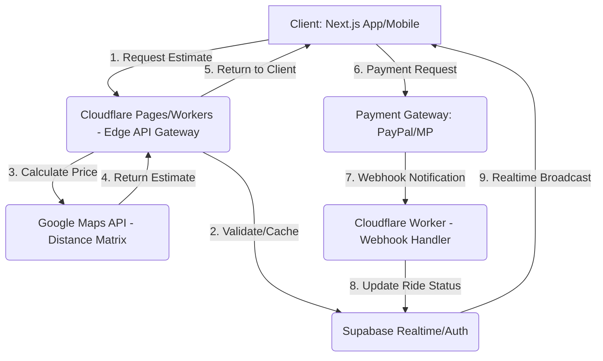

# NEXORS: TECHNICAL DEEP DIVE & INFRASTRUCTURE

**ROL:** CTO & Solutions Architect
**OBJETIVO:** Diseñar una arquitectura de sistemas resiliente, de baja latencia y escalable, capaz de manejar el crecimiento exponencial de NEXORS (1M de usuarios en 12 meses).

---

## 1. SYSTEM DESIGN (High-Level Architecture)

La arquitectura es **Edge-First Serverless**, diseñada para minimizar la latencia global y aprovechar la infraestructura *Backend-as-a-Service* (BaaS) de Supabase.

### Diagrama de Componentes (Flujo de Booking)

### Componentes Críticos

*   **Supabase Architecture:**
    *   **Tables:** Uso de RLS (Row Level Security) para aislar los datos de cada flotilla (multi-tenancy).
    *   **Auth Flow:** Delegado a Supabase Auth (JWTs) para autenticación de usuario, driver y gestor.
    *   **Realtime Subscriptions:** Uso de *channels* privados para el tracking de viajes y el chat (Driver/Pasajero).
*   **Cloudflare Workers:** Actúan como *API Gateway* y *BFF (Backend for Frontend)*. Manejan la lógica de negocio sensible (ej. cálculo de comisión, validación de pagos) y el *rate limiting* para proteger a Supabase.
*   **Database Sharding Strategy:**
    *   **Fase 1 (MVP):** No se requiere *sharding*. Supabase (PostgreSQL) puede manejar fácilmente los primeros 100k usuarios.
    *   **Fase 2 (1M Users):** Implementar *sharding* por geografía (ej. una instancia de Supabase para América, otra para EMEA). Esto reduce la latencia y aísla el riesgo.
*   **Microservices Roadmap:**
    *   **Q3 (Mes 7):** Separar el servicio de **Pagos** (mover la lógica de PayPal/MP a un Worker dedicado).
    *   **Q4 (Mes 10):** Separar el servicio de **Tracking** (mover la lógica de GPS y Realtime a un Worker dedicado que interactúe directamente con Redis/Kafka si es necesario).

---

## 2. SCALABILITY PLAN (Crecimiento Exponencial)

El plan de escalabilidad se centra en la optimización de la capa de Edge (Cloudflare) para absorber el tráfico antes de que llegue a la base de datos.

| Escenario | Usuarios Activos (MAU) | Bottlenecks Esperados | Solución de Escalabilidad |
| :--- | :--- | :--- | :--- |
| **Mes 1** | 1,000 | Latencia de API (llamadas a Google Maps). | Implementar *caching* de estimaciones de precios en Cloudflare Workers. |
| **Mes 6** | 100,000 | Conexiones a Supabase Realtime. | Optimizar los *channels* de Realtime (solo enviar datos esenciales). Escalar el plan de Supabase. |
| **Mes 12** | 1,000,000 | Consultas complejas de Analytics (Reportes B2B). | Implementar una réplica de lectura (Read Replica) de PostgreSQL en Supabase para el tráfico de Analytics. |

**Auto-Scaling Triggers:**
*   **Cloudflare Workers:** El escalamiento es automático y basado en la demanda (Serverless).
*   **Supabase:** Monitorear el uso de CPU y las conexiones activas. Si el uso de CPU supera el 80% durante 30 minutos, se activa una alerta para escalar el plan de la base de datos.

---

## 3. PERFORMANCE OPTIMIZATION (Velocidad de Élite)

| Área | Target | Estrategia de Optimización |
| :--- | :--- | :--- |
| **Frontend (Next.js)** | LCP < 2.5s, CLS < 0.1 | **Bundle Size:** Uso de *code splitting* y carga perezosa (*lazy loading*) para componentes no críticos. Optimización de imágenes (Next/Image). |
| **Backend (API)** | Response Time < 200ms (p95) | **Edge Computing:** Mover la lógica de precios y autenticación a Cloudflare Workers. Minimizar las llamadas en cascada a la base de datos. |
| **Database (PostgreSQL)** | Query Time < 50ms | **Indexing Strategy:** Crear índices en todas las claves foráneas (`FK`) y en las columnas utilizadas para la búsqueda (`rides.status`, `drivers.current_location`). |
| **Cache Strategy** | Hit Rate > 80% | **Cloudflare Cache:** Usar *Cache-Control* agresivo para activos estáticos (CSS, JS, imágenes). Cachear las respuestas de la API de estimación de precios por 5 minutos. |

---

## 4. DISASTER RECOVERY & BACKUP (Resiliencia)

| Métrica | Objetivo | Estrategia de Implementación |
| :--- | :--- | :--- |
| **RTO (Recovery Time Objective)** | Máximo 1 hora | **Failover:** Configurar una réplica de la base de datos en una región geográfica diferente (Supabase). |
| **RPO (Recovery Point Objective)** | Máximo 15 minutos | **Backup:** Backups continuos (PITR - Point-in-Time Recovery) de PostgreSQL. |
| **Backup Schedule** | Diario (Full), Horario (Incremental) | **Geographic Redundancy:** Almacenar los backups en un *bucket* S3 en una región diferente a la de la base de datos principal. |
| **Failover Plan** | Si Supabase cae, el tráfico se redirige a una Landing Page estática (Cloudflare Pages) con un mensaje de estado. El equipo de CTO inicia la restauración en la réplica. |
| **Testing Schedule** | Simulación de desastres (Chaos Testing) cada 3 meses. |

---

## 5. MONITORING & OBSERVABILITY (Visibilidad Total)

| Herramienta | Propósito | Alerta (Quién se Avisa) | SLA Target |
| :--- | :--- | :--- | :--- |
| **Sentry** | Error Tracking (Frontend/Backend) | CTO, Ingenieros de Software | **99.9%** (Uptime de la plataforma) |
| **Cloudflare Analytics** | Latencia de Edge, Tasa de Cache Hit, Ataques DDoS. | CTO, COO | **99.5%** (Disponibilidad de la API) |
| **Supabase Dashboard** | Uso de CPU, Conexiones, Consultas Lentas. | CTO, Ingenieros de Software | **99.95%** (Disponibilidad de la DB) |
| **Custom Logging (ELK Stack)** | Logs detallados de transacciones (`rides`, `payments`, `errors`). | COO, Head of Analytics | **Red Flag:** 500 errores > 1% del tráfico. |

---

## 6. TESTING STRATEGY (Calidad de Producción)

| Tipo de Prueba | Cobertura Mínima | Herramienta | Objetivo |
| :--- | :--- | :--- | :--- |
| **Unit Tests** | 70% del código de lógica de negocio (lib/pricing, lib/auth). | Jest | Asegurar la precisión de la lógica de precios y autenticación. |
| **Integration Tests** | Flujo de Booking (End-to-End), Flujo de Pago (Webhooks). | Cypress/Playwright | Asegurar que la integración entre Next.js, Workers y Supabase funcione correctamente. |
| **Load Testing** | 10,000 usuarios simultáneos (Mes 6 Target). | K6/JMeter | Identificar cuellos de botella en la API de Estimación y Realtime. |
| **Chaos Testing** | Deshabilitar la API de Google Maps. Deshabilitar el Realtime. | Manual (Trimestral) | Validar el Failover Plan y la resiliencia de la aplicación. |
| **Security Testing** | Penetration Test (Anual). | Auditoría Externa | Identificar vulnerabilidades de inyección SQL y XSS. |

---

## 7. DEPLOYMENT PIPELINE (CI/CD de Alta Frecuencia)

El objetivo es permitir múltiples *deployments* por día con riesgo cero.

*   **CI/CD:** GitHub Actions.
*   **Estrategia de Branching:** Git Flow (main para producción, develop para staging, feature branches).
*   **Staging Environment:** Un entorno de pre-producción idéntico a producción (usando una instancia de Supabase separada).
*   **Canary Deployments:** Implementar *rollout* gradual de nuevas versiones (ej. 10% del tráfico) en Cloudflare Workers antes del 100%.
*   **Rollback Strategy:** Si las métricas de monitoreo (Sentry, Cloudflare Analytics) muestran un aumento de errores del 5% en 5 minutos, GitHub Actions revierte automáticamente a la versión anterior.

---

## 8. VENDOR DEPENDENCIES & RISKS (Mitigación de Terceros)

| Vendor | Riesgo Crítico | Fallback Plan | SLA Contractual (Mínimo) |
| :--- | :--- | :--- | :--- |
| **Supabase** | Caída de la base de datos. | Failover a réplica en otra región. | 99.95% Uptime. |
| **Google Maps** | Aumento de costos o indisponibilidad. | Migración a Mapbox o HERE Maps (Q3). | 99.9% Uptime. |
| **PayPal/Mercado Pago** | Bloqueo de cuenta o indisponibilidad de API. | Integración con Stripe (Q2) como procesador de pagos terciario. | 99.9% Uptime. |
| **Cloudflare** | Caída de la red global. | Uso de DNS secundario (ej. AWS Route 53) para el dominio principal. | 100% Uptime (CDN/DNS). |

---
[Fin del Technical Deep Dive & Infrastructure]
