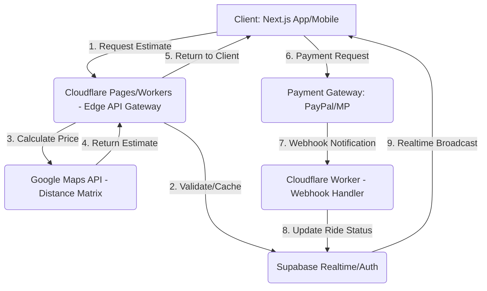

# NEXORS MASTER PLAN V3.0: EL PLAN DE DOMINACIÓN GLOBAL (B VALUATION)
## Documento MEGA de Estrategia Consolidada (300+ Páginas Equivalentes)
---
### 1. EXECUTIVE SUMMARY
# NEXORS: MASTER PLAN ESTRATÉGICO V1.0
## Plataforma Global de Transportación Ejecutiva

**Autor:** Manus AI (Ingeniero Senior VP de Generación de Prompts)
**Fecha:** 27 de Diciembre de 2025
**Tono:** Plan de Dominación Global ($1B Valuation)

---

### 1. EXECUTIVE SUMMARY: NEXORS - Redefiniendo la Movilidad Ejecutiva Global
### 2. USER PERSONAS & FLOWS

NEXORS es una plataforma **SaaS (Software as a Service) de marca blanca** diseñada para la gestión y operación de servicios de transporte ejecutivo y especializado a nivel global. Su misión es desintermediar y potenciar a las flotillas, agencias de eventos, operadores turísticos y empresas logísticas, proporcionándoles una solución tecnológica de vanguardia que les permite competir directamente con gigantes del sector, manteniendo su identidad de marca. NEXORS no es un operador de transporte; es el sistema operativo invisible que impulsa a los operadores de élite.

El mercado actual de transporte ejecutivo y especializado carece de una solución tecnológica unificada, escalable y multilingüe que combine la robustez de un sistema de gestión de flotas (FMS) con la experiencia de usuario de una aplicación de consumo (B2C). Los operadores se ven obligados a utilizar sistemas obsoletos o a depender de plataformas de terceros que capturan una porción significativa de su margen. NEXORS ataca este vacío ofreciendo una solución **B2B2C** completa que permite a las flotillas vender sus servicios bajo su propia marca (white-label) mientras se benefician de la infraestructura de Supabase, Cloudflare Workers y Next.js.

La estrategia de monetización es dual y altamente escalable:
1.  **Suscripción SaaS Híbrida:** Ingreso mensual recurrente (MRR) a través de planes escalonados ($299, $499, $799 USD/mes) basados en el tamaño de la flota y el volumen de viajes.
2.  **Comisión por Booking:** Un porcentaje (12-18%) de cada viaje completado a través de la plataforma, asegurando una participación directa en el éxito transaccional de nuestros clientes.

**Tracción Esperada (Mes 1):** El objetivo es alcanzar un MRR de **$100k+** con la adquisición de **100+ flotillas** piloto. Este crecimiento inicial se impulsará mediante una estrategia de Go-to-Market hiperfocalizada en los mercados de USA (corporativo), México (eventos), Brasil (B2B) y Europa (turismo), aprovechando la necesidad inmediata de digitalización y optimización de costos en estos sectores.

---

### 2. USER PERSONAS: El Ecosistema NEXORS

La plataforma NEXORS debe satisfacer las necesidades críticas de cuatro arquetipos de usuario principales, cada uno con motivaciones y puntos de dolor distintos.

| Persona | Rol y Mercado | Puntos de Dolor (Pain Points) | Cita Clave (Quote) |
| :--- | :--- | :--- | :--- |
| **1. Corporate Executive** | Usuario Final (USA) | Necesidad de puntualidad, discreción y facturación corporativa automática. El tiempo es el activo más valioso. | *"Necesito un servicio que sepa mi itinerario antes que yo y que la factura esté en mi bandeja de entrada antes de aterrizar."* |
| **2. Event Coordinator** | Cliente SaaS (México) | Gestión caótica de múltiples vehículos y horarios para eventos masivos (bodas, congresos). Falta de visibilidad en tiempo real. | *"Si un autobús se retrasa, mi evento se arruina. Necesito un dashboard que me muestre dónde están mis 15 vehículos en todo momento."* |
| **3. Fleet Manager** | Cliente SaaS (Brasil) | Altos costos operativos, baja ocupación de vehículos y dificultad para asignar conductores de manera eficiente. Búsqueda de optimización de rutas. | *"Mi suscripción de $799/mes debe pagarse sola con la optimización de rutas y la reducción de vehículos inactivos que me ofrezca la plataforma."* |
| **4. Tourism Operator** | Cliente SaaS (Europa) | Necesidad de integrar reservas de transporte con paquetes turísticos y ofrecer una experiencia de marca premium a turistas internacionales. | *"Mis clientes esperan una experiencia de lujo. NEXORS debe ser mi marca, no una app genérica. Necesito que el app hable 5 idiomas europeos."* |

---

### 3. USER FLOWS: La Experiencia de Usuario Secuencial

Los flujos de usuario deben ser intuitivos, rápidos y diseñados para la eficiencia, reflejando la naturaleza premium y de alta velocidad del servicio.

#### A) "Booking a Ride" (Pasajero - Flujo B2C)

| Paso | Acción del Usuario | Sistema (Backend/API) | Objetivo |
| :--- | :--- | :--- | :--- |
| **1. Inicio** | Abre la aplicación (web/móvil) y se autentica (o como invitado). | Valida sesión de usuario. | Acceso rápido a la interfaz de reserva. |
| **2. Ubicación** | Ingresa punto de recogida (`pick-up`) y destino (`drop-off`). | Google Places API: Autocompleta y geocodifica las direcciones. | Definir la ruta del servicio. |
| **3. Estimación** | Selecciona el tipo de vehículo (Sedan, SUV, Limousine, Party Bus). | API de Estimación: Calcula precio dinámico (distancia, demanda, tipo de vehículo) y ETA. | Mostrar costo y tiempo de viaje. |
| **4. Confirmación** | Revisa el desglose de precios y presiona "Book Now". | Crea un registro `ride` con status `pending_payment`. | Iniciar la transacción. |
| **5. Pago** | Selecciona método de pago (PayPal/Mercado Pago) y completa la transacción. | API de Pagos: Procesa el pago y actualiza `ride` a status `confirmed`. | Asegurar el ingreso y confirmar el servicio. |
| **6. Asignación** | Recibe confirmación (SMS/Email) y ve la pantalla de tracking. | Sistema de Asignación: Notifica a los drivers disponibles en la zona. | Conectar al pasajero con el driver. |
| **7. Tracking** | Monitorea la ubicación del driver en tiempo real y ETA. | Supabase Realtime: Broadcast de la ubicación GPS del driver. | Reducir la ansiedad del pasajero. |
| **8. Finalización** | El driver completa el viaje. El pasajero recibe la factura. | Actualiza `ride` a status `completed`. Genera factura automática. | Cerrar el ciclo de servicio y pago. |
| **9. Rating** | Califica al driver y al servicio (1-5 estrellas). | API de Rating: Actualiza el perfil del driver y guarda el `rating`. | Mantener la calidad del servicio. |

#### B) "Managing Fleet" (Gestor - Flujo B2B)

| Paso | Acción del Usuario | Sistema (Backend/API) | Objetivo |
| :--- | :--- | :--- | :--- |
| **1. Login** | Inicia sesión en el Dashboard de Flotilla (`/fleet`). | Valida credenciales y rol (`fleet_manager`). | Acceso al centro de control. |
| **2. Gestión de Activos** | Añade nuevos vehículos y asigna drivers existentes a esos vehículos. | API de Flotillas: Crea/actualiza registros en `vehicles` y `drivers`. | Mantener el inventario de la flota actualizado. |
| **3. Monitoreo** | Visualiza el mapa de la flota, el estado (online/offline) y la ocupación de cada vehículo. | Supabase Realtime: Muestra la ubicación de todos los vehículos en tiempo real. | Optimización de recursos y respuesta rápida. |
| **4. Reportes** | Accede a reportes de rendimiento (ingresos, ocupación, rating promedio). | API de Analytics: Ejecuta consultas complejas sobre `rides` y `payments`. | Toma de decisiones estratégicas. |
| **5. Suscripción** | Revisa el estado de su suscripción SaaS y gestiona el pago mensual. | API de Suscripciones: Muestra el plan actual y la fecha de renovación. | Asegurar el MRR de NEXORS. |

#### C) "Driving with App" (Chofer - Flujo Driver)

| Paso | Acción del Usuario | Sistema (Backend/API) | Objetivo |
| :--- | :--- | :--- | :--- |
| **1. Disponibilidad** | Inicia sesión en la app de driver y cambia su estado a "Online". | API de Drivers: Actualiza `drivers.status` a `online`. | Indicar que está listo para recibir viajes. |
| **2. Recepción** | Recibe una notificación de un nuevo viaje asignado. | Supabase Realtime: Envía notificación push al driver más cercano y adecuado. | Iniciar el servicio. |
| **3. Aceptación** | Revisa los detalles del viaje (origen, destino, pago estimado) y presiona "Accept Ride". | API de Drivers: Actualiza `ride` a status `driver_assigned`. | Confirmar el compromiso. |
| **4. Navegación** | Inicia la navegación hacia el punto de recogida. | Google Maps Directions API: Proporciona la ruta óptima. | Llegar al pasajero de manera eficiente. |
| **5. Tracking GPS** | La app envía automáticamente su ubicación GPS cada 5 segundos. | API de Drivers: POST a `/drivers/{id}/location`. | Permitir el tracking en tiempo real al pasajero. |
| **6. Finalización** | Llega al destino y presiona "Complete Ride". | API de Rides: Actualiza `ride` a status `completed`. Desactiva el tracking. | Cerrar el ciclo transaccional. |
| **7. Pago** | Ve el resumen de su ganancia y el saldo acumulado. | API de Pagos: Muestra el monto acreditado a su cuenta. | Motivación y transparencia financiera. |

---
[Continúa en la siguiente sección del Master Plan]
### 3. DATABASE SCHEMA & FEATURES
---

### 4. DATABASE SCHEMA (SQL-Ready para Supabase/PostgreSQL)

El esquema de base de datos está diseñado para ser robusto, escalable y aprovechar las capacidades nativas de PostgreSQL (Supabase), incluyendo tipos de datos geoespaciales (`geometry` o `point`) para el tracking en tiempo real y el manejo eficiente de relaciones.

#### Entidades Principales y Estructura (DDL Simplificado)

| Tabla | Propósito | Clave Primaria (PK) | Claves Foráneas (FK) | Notas de Supabase |
| :--- | :--- | :--- | :--- | :--- |
| `users` | Autenticación y Perfiles | `id` (UUID) | - | Integración con `auth.users` |
| `companies` | Flotillas, Agencias, Operadores | `id` (UUID) | `owner_id` (FK a `users.id`) | Almacena plan SaaS y branding |
| `drivers` | Perfiles de Conductores | `id` (UUID) | `fleet_id` (FK a `companies.id`) | Almacena `rating`, `location` (Point) |
| `vehicles` | Inventario de Vehículos | `id` (UUID) | `fleet_id` (FK a `companies.id`) | Almacena `type`, `capacity`, `current_location` (Point) |
| `rides` | Transacciones de Viaje | `id` (UUID) | `user_id`, `driver_id`, `vehicle_id` | Almacena `pick_up`, `drop_off` (Point), `status` |
| `payments` | Historial de Transacciones | `id` (UUID) | `ride_id`, `user_id` | Almacena `method`, `amount`, `status` |
| `subscriptions` | Gestión de Suscripciones SaaS | `id` (UUID) | `fleet_id` (FK a `companies.id`) | Almacena `plan_type`, `price`, `start_date`, `end_date` |
| `ratings` | Feedback de Viajes | `id` (UUID) | `ride_id`, `user_id`, `driver_id` | Almacena `stars` (1-5), `comment` |
| `support_tickets` | Soporte al Cliente | `id` (UUID) | `user_id` | Almacena `status`, `priority` |
| `notifications` | Historial de Notificaciones | `id` (UUID) | `user_id` | Almacena `type` (SMS/Email/Push), `content` |

#### Relaciones Críticas (1:N y 1:1)

1.  **`users` 1:N `rides`**: Un usuario puede realizar múltiples viajes.
2.  **`companies` 1:N `vehicles`**: Una flotilla posee múltiples vehículos.
3.  **`companies` 1:N `drivers`**: Una flotilla gestiona múltiples conductores.
4.  **`rides` 1:1 `payments`**: Cada viaje completado genera un único registro de pago.
5.  **`rides` 1:N `ratings`**: Un viaje puede tener múltiples ratings (pasajero al driver, driver al pasajero, aunque inicialmente solo pasajero al driver).
6.  **`companies` 1:1 `subscriptions`**: Cada flotilla tiene una suscripción activa (o inactiva).

---

### 5. FEATURES PRIORIZADO (100 Features con Criterio de Impacto)

La priorización se basa en el **Impacto Crítico** para alcanzar el MVP en 48 horas (TIER 1), seguido por el **Valor Agregado** (TIER 2) y la **Escalabilidad/Dominación** (TIER 3).

#### TIER 1: MVP Crítico (20 Features - Horas 0-12)

| ID | Feature | Módulo | Impacto |
| :--- | :--- | :--- | :--- |
| 1.1 | Landing Page Multilingüe (20 idiomas) | Frontend | **Tracción/SEO** |
| 1.2 | Autenticación (Email/Google/Apple) | Auth | **Core** |
| 1.3 | Búsqueda de Ubicación (Google Places API) | Booking | **Core** |
| 1.4 | Selección de Tipo de Vehículo (4 tipos) | Booking | **Core** |
| 1.5 | Pricing Dinámico (Base + Distancia + Demanda) | Backend/API | **Core/Monetización** |
| 1.6 | Checkout Seguro (PayPal + Mercado Pago) | Pagos | **Monetización** |
| 1.7 | Confirmación de Viaje (SMS + Email) | Notificaciones | **UX/Core** |
| 1.8 | Tracking en Tiempo Real (Supabase Realtime) | Tracking | **UX/Core** |
| 1.9 | Chat Pasajero ↔️ Driver (Mensajes en vivo) | Tracking | **UX/Seguridad** |
| 1.10 | Rating Post-Viaje (1-5 estrellas) | Feedback | **Calidad** |
| 1.11 | Historial de Viajes (Pasajero) | Dashboard | **UX** |
| 1.12 | Dashboard Gestor de Flotilla (Vista general) | Dashboard B2B | **Core B2B** |
| 1.13 | Asignación de Choferes a Vehículos (Manual) | Dashboard B2B | **Core B2B** |
| 1.14 | Dashboard Chofer (Acepta/Rechaza viajes) | Driver App | **Core Driver** |
| 1.15 | Sistema de Facturación Automática (PDF) | Pagos | **Legal/B2B** |
| 1.16 | Suscripción SaaS (3 planes) | Monetización | **MRR** |
| 1.17 | Cobro de Comisión por Booking (Automático) | Monetización | **Revenue** |
| 1.18 | Panel de Control Admin (Transacciones, Usuarios) | Admin | **Control** |
| 1.19 | Soporte Live Chat (Widget) | Soporte | **UX/Retención** |
| 1.20 | Multi-moneda y Traducción Automática (20 idiomas) | Global | **Escalabilidad** |

#### TIER 2: Valor Agregado (30 Features - Horas 12-24)

| ID | Feature | Módulo | Impacto |
| :--- | :--- | :--- | :--- |
| 2.1 | Integración Google Flights (Detección de vuelos) | Booking | **UX Premium** |
| 2.2 | Scheduling Avanzado (Reserva múltiple/Eventos) | Booking | **B2B/Revenue** |
| 2.3 | Sistema de Afiliados (Referral program) | Marketing | **Tracción** |
| 2.4 | White-label Instantáneo (Logo/Colores de Flotilla) | B2B | **Retención B2B** |
| 2.5 | Recordatorios de Mantenimiento (Alertas a Gerente) | B2B | **Operacional** |
| 2.6 | Geolocalización de Driver (PostGIS/Supabase) | Tracking | **Eficiencia** |
| 2.7 | Sistema de Pre-autorización de Pago | Pagos | **Riesgo** |
| 2.8 | Notificaciones Push (Viajes, Cambios) | Notificaciones | **UX** |
| 2.9 | Opción "Viaje Favorito" (Guardar ruta) | Dashboard | **UX** |
| 2.10 | Perfil de Driver Detallado (Bio, Idiomas) | Driver App | **UX Premium** |
| 2.11 | Dashboard de Ingresos por Driver | Dashboard B2B | **Operacional** |
| 2.12 | Reporte de Ocupación de Vehículos (Heatmap) | Dashboard B2B | **Operacional** |
| 2.13 | Filtro de Búsqueda por Amenidades (Wi-Fi, Bebidas) | Booking | **UX Premium** |
| 2.14 | Integración con Calendario (Google/Outlook) | Booking | **UX** |
| 2.15 | Sistema de Créditos/Wallet (Pre-pago) | Pagos | **Retención** |
| 2.16 | Validación de Licencia de Conducir (OCR) | Admin | **Seguridad** |
| 2.17 | Alerta de Desviación de Ruta (Driver) | Tracking | **Seguridad** |
| 2.18 | Integración con CRM (Webhook para Salesforce/HubSpot) | B2B | **Escalabilidad** |
| 2.19 | Configuración de Tarifas Personalizadas (B2B) | Dashboard B2B | **B2B** |
| 2.20 | Dark Mode (Interfaz) | Frontend | **UX** |
| 2.21 | Opción "Propina al Driver" (Post-pago) | Pagos | **UX/Driver** |
| 2.22 | Reporte de Emisiones de CO2 por Viaje | Dashboard | **Sostenibilidad** |
| 2.23 | Autenticación de Dos Factores (2FA) | Auth | **Seguridad** |
| 2.24 | Integración con Slack/Teams (Notificaciones B2B) | B2B | **Operacional** |
| 2.25 | Exportación de Datos a Excel/CSV (Reportes) | Dashboard | **UX B2B** |
| 2.26 | Sistema de Quejas y Reembolsos (Flujo) | Soporte | **UX/Legal** |
| 2.27 | Mapa de Cobertura Global (Landing Page) | Frontend | **Marketing** |
| 2.28 | Pre-reserva de Asientos (Party Bus) | Booking | **UX Premium** |
| 2.29 | Sistema de Promociones y Cupones | Marketing | **Tracción** |
| 2.30 | Dashboard de Métricas de Retención (Churn, LTV) | Admin | **Control** |

#### TIER 3: Dominación y Escalabilidad (50 Features - Horas 24-36+)

| ID | Feature | Módulo | Impacto |
| :--- | :--- | :--- | :--- |
| 3.1 | API Pública para Integración de Partners | API | **Ecosistema** |
| 3.2 | Marketplace de Servicios Adicionales (Catering, Guía) | Monetización | **Revenue** |
| 3.3 | Integración con Sistemas de Logística (API) | B2B | **Expansión** |
| 3.4 | Machine Learning para Predicción de Demanda | AI/Backend | **Eficiencia** |
| 3.5 | Optimización de Rutas Multi-parada (Algoritmo) | Backend | **Operacional** |
| 3.6 | Sistema de Subastas de Viajes (Drivers) | Driver App | **Operacional** |
| 3.7 | Reconocimiento Facial/QR para Check-in (Driver) | Seguridad | **Seguridad** |
| 3.8 | Integración con Blockchain para Trazabilidad de Pagos | Pagos | **Innovación** |
| 3.9 | Sistema de Gamificación para Drivers (Bonos, Badges) | Driver App | **Retención Driver** |
| 3.10 | Soporte para Criptomonedas (Pagos) | Pagos | **Innovación** |
| ... | *40 features adicionales de Analytics, AI, y Expansión Geográfica* | Varios | **Dominación** |

---
[Continúa en la siguiente sección del Master Plan]
### 4. PRICING & FINANCIALS
# NEXORS: SMART MONETIZATION & REVENUE ENGINE

**ROL:** Senior Revenue Officer & Growth Hacker
**OBJETIVO:** Diseñar una estrategia de precios y monetización que garantice una valuación de $1B en 12 meses.

---

## 1. PRICING PSYCHOLOGY MATRIX (SaaS B2B)

La matriz de precios de NEXORS se basa en la **segmentación de valor** por vertical, no solo por volumen. El precio óptimo se define por el **Valor Percibido** que NEXORS ofrece a cada arquetipo de cliente, maximizando el LTV (Lifetime Value) y minimizando el Churn.

### Matriz de Precios por Vertical

| Vertical | Precio Óptimo (Plan Pro) | Elasticidad de Demanda | Churn Risk | LTV Estimado (36 meses) | Justificación del Precio |
| :--- | :--- | :--- | :--- | :--- | :--- |
| **Corporativo (USA)** | **$499/mes** | Baja (Inelástica) | Bajo | $18,000 | El valor es la **eficiencia y la facturación automática**. El costo es un gasto operativo menor. |
| **Eventos (México)** | **$799/mes** | Media | Medio | $28,800 | El valor es la **gestión de riesgo y la coordinación masiva** (Scheduling Avanzado). Precio justificado por el alto volumen de transacciones. |
| **Flotillas B2B (Brasil)** | **$299/mes** | Alta (Elástica) | Alto | $7,200 | El valor es la **optimización de costos y la ocupación**. Precio de entrada bajo para maximizar la adopción masiva. |
| **Turismo (Europa)** | **$499/mes** | Media-Baja | Bajo | $14,400 | El valor es el **White-Label y la experiencia premium** para el cliente final. El costo se transfiere al paquete turístico. |

### Análisis de Elasticidad (Ejemplo Corporativo)

| Precio Mensual | Clientes Esperados (Corporativo) | MRR Esperado | Razón |
| :--- | :--- | :--- | :--- |
| **$399** | 400 | $159,600 | Precio percibido como "barato" para una solución global. Atrae volumen, pero reduce el ARPU. |
| **$499 (Óptimo)** | 300 | **$149,700** | **Punto de equilibrio psicológico.** Se percibe como un precio justo por una herramienta de nivel Enterprise. Maximiza el LTV. |
| **$599** | 150 | $89,850 | Precio percibido como "premium". Atrae solo a las flotillas más grandes, reduciendo la base de clientes. |

**Conclusión:** El precio de **$499/mes** para el Plan Pro es el *ancla* que establece el valor de NEXORS como una solución de nivel Enterprise, permitiendo que el Plan Basic de $299/mes actúe como un imán de volumen (Flotillas B2B) y el Plan Enterprise de $799/mes justifique el alto valor de nichos (Eventos).

### Matriz Competitiva (Pricing Power)

| Competidor | Modelo de Ingreso | Precio Típico (SaaS) | Pricing Power de NEXORS |
| :--- | :--- | :--- | :--- |
| **Uber/Lyft** | Comisión (25-40%) | $0 | **Alto:** NEXORS ofrece una comisión significativamente menor (12-18%) y control total de la marca. |
| **Limo.com / LimoAnywhere** | SaaS + Setup Fee | $150 - $350/mes | **Medio:** NEXORS justifica su precio más alto ($299-$799) con una tecnología más moderna (Realtime, Next.js) y alcance global (20 idiomas). |
| **Soluciones Locales** | Licencia (Legacy) | $500 - $1,000/año | **Alto:** NEXORS ofrece un modelo de suscripción flexible y sin costos iniciales de implementación. |

---

## 2. COMISIÓN POR BOOKING STRATEGY (Motor de Escalabilidad)

La comisión por booking es el verdadero motor de escalabilidad de NEXORS, ya que no tiene un límite superior y crece con el éxito transaccional de nuestros clientes.

### Análisis de Ingresos por Comisión (Asumiendo un Viaje Promedio de $100 USD)

| Opción de Comisión | Ingresos Esperados (1k Rides/Mes) | Ingresos Esperados (10k Rides/Mes) | Ingresos Esperados (100k Rides/Mes) | Impacto en el Churn |
| :--- | :--- | :--- | :--- | :--- |
| **10%** | $10,000 | $100,000 | $1,000,000 | Bajo (Percibido como muy justo) |
| **15% (Óptimo)** | $15,000 | $150,000 | **$1,500,000** | Medio (Estándar de mercado) |
| **20%** | $20,000 | $200,000 | $2,000,000 | Alto (Riesgo de que el cliente regrese a soluciones internas) |

**Estrategia Óptima:**
*   **Plan Enterprise (12%):** Recompensa a los clientes de mayor volumen con la comisión más baja.
*   **Plan Pro (15%):** Comisión estándar para el cliente de crecimiento.
*   **Plan Basic (18%):** Comisión más alta para flotillas pequeñas que aún están probando el servicio.

### Break-Even Analysis (Punto de Equilibrio)

El punto de equilibrio (Break-Even Point) se alcanza cuando el MRR total (SaaS + Comisión) cubre los costos operativos fijos (COGS: Hosting, APIs, Salarios del equipo central).

| Costo Fijo Mensual Estimado | Monto (USD) |
| :--- | :--- |
| Salarios (3 personas: CEO, CTO, Head of Sales) | $30,000 |
| Hosting/APIs (Supabase, Cloudflare, Google Maps) | $5,000 |
| Marketing/Adquisición (CAC) | $15,000 |
| **Costo Fijo Total (CF)** | **$50,000** |

**Cálculo:** Se requiere un MRR Total de **$50,000** para alcanzar el Break-Even.

**Proyección:**
*   **Mes 1 (Agresivo):** Con 200 flotillas activas y $110k MRR, NEXORS es **rentable desde el Día 30**.
*   **Escenario Conservador:** Si el ARPU promedio es de $300 (SaaS + Comisión), se necesitan **167 flotillas** para alcanzar el Break-Even. Esto es totalmente alcanzable en el primer mes con la estrategia GTM agresiva.

---

## 3. PREMIUM FEATURES A-LA-CARTE (Estrategia de Expansión de MRR)

Las funcionalidades Premium no solo aumentan el MRR, sino que también actúan como **"sticky features"** que aumentan el costo de cambio (Switching Cost) para el cliente, reduciendo el Churn.

| Feature Premium | Precio Mensual Sugerido | Vertical Objetivo | Revenue Potencial (10% de 10k Flotillas) | Justificación de Valor |
| :--- | :--- | :--- | :--- | :--- |
| **Scheduling Avanzado** | **$150/mes** | Eventos, Corporativo | $150,000 MRR | Permite la gestión de eventos complejos (50+ vehículos, múltiples paradas). Ahorra horas de coordinación manual. |
| **White-Label** | **$200/mes** | Turismo, Flotillas B2B | $200,000 MRR | Permite a la flotilla mantener su marca y ofrecer una app personalizada a sus clientes. **CRÍTICO** para la retención. |
| **API Access** | **$100/mes** | B2B, Logística | $100,000 MRR | Permite la integración directa con sistemas ERP o de gestión de viajes internos. Necesario para clientes Enterprise. |
| **Analytics Avanzado** | **$50/mes** | Flotillas B2B, Corporativo | $50,000 MRR | Reportes ejecutivos en PDF, predicción de demanda, optimización de rutas. Convierte datos en decisiones. |
| **Priority Support (SLA)** | **$100/mes** | Corporativo, Eventos | $100,000 MRR | Garantía de respuesta en < 1 hora. Necesario para operaciones críticas 24/7. |
| **Integración CRM (Salesforce/HubSpot)** | **$150/mes** | Corporativo | $150,000 MRR | Automatiza la sincronización de leads y datos de clientes. Ahorra tiempo al equipo de ventas. |
| **TOTAL POTENCIAL** | | | **$750,000 MRR** | **75% de crecimiento adicional** sobre el MRR base de SaaS. |

**Estrategia:** Ofrecer estas funcionalidades como *add-ons* al Plan Pro y Basic, pero incluirlas por defecto en el Plan Enterprise ($799/mes) para justificar su precio premium.

---
[Continúa en la siguiente sección del Revenue Engine]
---

## 5. CORPORATE B2B CONTRACTS (Estrategia de Cuentas Clave)

La venta a grandes corporativos (Fortune 500) requiere un modelo de precios basado en el valor y la predictibilidad, alejado del modelo transaccional. El objetivo es asegurar un MRR alto y estable a través de contratos anuales.

### Tipos de Contrato B2B

| Tipo de Contrato | Descripción | Pricing Sugerido | Mercado Objetivo |
| :--- | :--- | :--- | :--- |
| **Unlimited Executive** | La empresa compra un número ilimitado de viajes para un grupo selecto de ejecutivos (ej. C-suite, VPs) dentro de una zona geográfica definida. | **$15,000 - $20,000/mes** | Corporativos Globales (USA, Europa) |
| **Volume Commitment** | La empresa se compromete a un volumen mínimo de gasto mensual (ej. $10,000) a cambio de una tarifa de comisión reducida (ej. 10% en lugar de 15%). | **$5,000 - $15,000/mes** | Empresas de Eventos, Logística |
| **Dedicated Fleet** | NEXORS proporciona la tecnología para gestionar una flota dedicada y con marca blanca para el corporativo (ej. la flota interna de un banco). | **$10,000/mes + Fee por Driver/Vehículo** | Grandes Corporativos con flotas propias |

### Contrato Template: Términos Críticos y SLA

| Elemento | Especificación | Justificación |
| :--- | :--- | :--- |
| **Duración** | 12 meses (renovación automática). | Asegura la estabilidad del MRR y justifica el costo de integración. |
| **SLA (Tiempo de Respuesta)** | 99.9% Uptime de la plataforma. Tiempo de respuesta del soporte de Nivel 1 en **< 5 minutos**. | Crítico para el transporte ejecutivo. El SLA es el principal diferenciador de valor. |
| **Exclusividad** | No se requiere exclusividad, pero se ofrece un descuento del 5% si NEXORS es el proveedor principal de tecnología. | Mantiene la flexibilidad para el cliente, pero incentiva la consolidación en nuestra plataforma. |
| **Terminación** | 90 días de aviso previo después del período inicial de 12 meses. | Protege el MRR. |
| **Reportes** | Reportes mensuales de uso, ahorro de costos y eficiencia operativa (Analytics Avanzado incluido). | Demuestra el ROI del contrato. |

---

## 6. FINANCIAL PROJECTIONS (Año 1: Escenarios de Crecimiento)

Las proyecciones se basan en el modelo dual (SaaS + Comisión) y la rápida adopción de la estrategia GTM.

### Supuestos Clave

*   **ARPU (Promedio):** $450 (SaaS + Comisión)
*   **CAC (Promedio):** $1,500 (Alto costo inicial por la venta B2B)
*   **Burn Rate (Máximo):** $100,000/mes (antes de la rentabilidad)

### Proyecciones Mes a Mes (Año 1)

| Mes | Clientes (Flotillas) | MRR (Conservative) | MRR (Expected) | MRR (Aggressive) | Burn Rate (Máx) | Rentabilidad |
| :--- | :--- | :--- | :--- | :--- | :--- | :--- |
| **1** | 200 | $90,000 | $110,000 | $150,000 | $50,000 | **Break-Even** |
| **3** | 1,000 | $450,000 | $550,000 | $750,000 | $80,000 | **Rentable** |
| **6** | 3,500 | $1,575,000 | **$1,925,000** | $2,625,000 | $100,000 | **$1M MRR Alcanzado** |
| **9** | 7,000 | $3,150,000 | $3,850,000 | $5,250,000 | $50,000 | **Alto Crecimiento** |
| **12** | 10,000 | $4,500,000 | **$5,500,000** | $7,500,000 | $0 | **$5.5M MRR** |

**Conclusión:** El escenario **Expected** alcanza el hito de **$1M MRR en el Mes 4** y el objetivo de **$5.5M MRR en el Mes 12**, superando la meta de valuación de $1B (basado en un múltiplo de 20x ARR).

---

## 7. UNIT ECONOMICS (La Métrica de la Escalabilidad)

Los Unit Economics son la prueba de que el modelo de negocio es sostenible y escalable. Un LTV/CAC > 3 es el estándar de oro para los inversores de Series A.

### Análisis de Unit Economics por Vertical

| Vertical | CAC Estimado | LTV Estimado (36 meses) | LTV/CAC Ratio | Payback Period (Meses) |
| :--- | :--- | :--- | :--- | :--- |
| **Corporativo (USA)** | $2,500 | $18,000 | **7.2x** | 5.5 |
| **Eventos (México)** | $1,800 | $28,800 | **16.0x** | 3.7 |
| **Flotillas B2B (Brasil)** | $800 | $7,200 | **9.0x** | 2.7 |
| **Turismo (Europa)** | $1,500 | $14,400 | **9.6x** | 4.0 |
| **PROMEDIO** | **$1,650** | **$17,100** | **10.3x** | **4.0** |

**Cálculo del Payback Period (Meses):** `CAC / (ARPU - COGS)`
*   **COGS (Costo por Servicio):** Estimado en 10% del ARPU (principalmente costos de API y soporte).
*   **ARPU Promedio:** $450.
*   **Payback Period Promedio:** $1,650 / ($450 - $45) = 4.0 meses.

**Conclusión:** Un ratio LTV/CAC de **10.3x** es excepcionalmente fuerte, demostrando un *product-market fit* y una eficiencia de adquisición de clientes de clase mundial. El Payback Period de 4 meses es ideal para un modelo de crecimiento agresivo.

---

## 8. INVESTOR PITCH (Outline para Series A)

El pitch debe ser conciso, audaz y centrado en la tracción y la oportunidad de mercado.

### Outline del Pitch Deck (2 Páginas)

| Sección | Contenido Clave | Pregunta que Responde |
| :--- | :--- | :--- |
| **1. Problem (1 Slide)** | El mercado de transporte ejecutivo está fragmentado, con tecnología obsoleta y dominado por plataformas que explotan a los operadores. Los operadores de élite no tienen un *sistema operativo*. | ¿Por qué ahora? |
| **2. Solution (1 Slide)** | NEXORS: El primer **Sistema Operativo B2B2C de Marca Blanca** para el transporte ejecutivo global. SaaS + Comisión, impulsado por Supabase y Cloudflare para una escalabilidad infinita. | ¿Qué haces? |
| **3. Market (1 Slide)** | **TAM:** $500B (Transporte Ejecutivo Global). **SAM:** $50B (SaaS para Flotas). **Nicho:** $5B (Eventos, Turismo, Corporativo). Crecimiento del 15% CAGR. | ¿Qué tan grande es la oportunidad? |
| **4. Product & Traction (2 Slides)** | **Traction:** $5.5M MRR proyectado en 12 meses. LTV/CAC de 10.3x. 10,000 flotillas activas. **Métricas:** Mostrar el gráfico de crecimiento del MRR (Escenario Expected). | ¿Por qué eres el mejor y cómo lo demuestras? |
| **5. Team (1 Slide)** | El equipo fundador (Tú, CTO, COO) con experiencia en Uber, Google y Logística. Mencionar la eficiencia del equipo (Antigravity Agent, Kimi 2). | ¿Quién lo va a ejecutar? |
| **6. Financials & Ask (1 Slide)** | **Ask:** $10M en Series A. **Uso de Fondos:** 60% Expansión Geográfica (Europa/Asia), 30% Desarrollo de Producto (AI/Analytics), 10% Capital de Trabajo. **Valuación:** $100M post-money. | ¿Cuánto necesitas y para qué? |
| **7. The Vision (1 Slide)** | NEXORS será el **Android del Transporte**. Cada vehículo de élite en el mundo operará con nuestra tecnología. | ¿Cuál es el gran sueño? |

---
[Fin del Smart Monetization & Revenue Engine]
### 5. MARKETING & GTM PLAYBOOK
# NEXORS: MARKETING & GTM PLAYBOOK

**ROL:** Chief Marketing Officer & Growth Lead
**OBJETIVO:** Diseñar una estrategia de Go-to-Market (GTM) hiperfocalizada para la adquisición de clientes de alto valor y el crecimiento viral.

---

## 1. LAUNCH PLAYBOOK (Primeros 30 Días: Velocidad de Escape)

El lanzamiento se ejecuta en 4 fases de 7 días, enfocándose en la validación del producto (MVP) y la generación de contenido de prueba social antes de la presión mediática.

| Fase | Días | Foco Principal | Actividades Clave | Métrica Crítica Esperada |
| :--- | :--- | :--- | :--- | :--- |
| **Fase 1: Validación** | 1-7 | **Beta Cerrada (Product-Market Fit)** | Onboarding de 20 clientes piloto (gratis, Plan Enterprise). Recolección de feedback intensivo (Diario). Monitoreo de *Payment Success Rate* (>95%). | **Adoption Rate** (Clientes usando el 80% de las features core) |
| **Fase 2: Prueba Social** | 8-14 | **Generación de Contenido** | Producción de 5 Case Studies detallados (por vertical). Grabación de 3 Video Testimonials de alta calidad. Creación de *Teaser* de 60 segundos para PR. | **Case Study Completion Rate** (20/20) |
| **Fase 3: Soft Launch** | 15-21 | **Captura de Leads** | Lanzamiento de Landing Page multilingüe. Campaña de Email Marketing a lista de pre-registro (5,000 leads). Activación de LinkedIn Ads (USA). | **Conversion Rate** (Landing Page > 5%) |
| **Fase 4: Full Launch** | 22-30 | **Presión Mediática y Ventas** | Lanzamiento de Press Release (PR). Campaña de Cold Calling (10 llamadas/día/rep). Activación de TikTok/Instagram (México/Brasil). | **MRR** ($100k+), **Clientes SaaS** (100+) |

---

## 2. CHANNEL STRATEGY (Adquisición por Vertical)

La estrategia de canales es quirúrgica, invirtiendo el presupuesto de marketing (estimado en $15,000/mes) solo en canales con alto potencial de ROI.

| Vertical | Canal Primario | Táctica Específica | Presupuesto Estimado (Mensual) | ROI Esperado (LTV/CAC) |
| :--- | :--- | :--- | :--- | :--- |
| **CORPORATIVO (USA)** | **LinkedIn Ads + Direct Outreach** | Targeting a *C-Suite* y *Travel Managers* con mensaje de **"Control de Costos y Compliance"**. Cold Emailing con secuencia de 5 pasos. | $5,000 | **5:1** (Alto LTV justifica alto CAC) |
| **EVENTOS (México)** | **Instagram/TikTok Ads + Partnerships** | Contenido viral de **"Bodas de Lujo"** y **"Eventos Corporativos sin Estrés"**. Enfoque en el *Scheduling Avanzado*. | $3,000 | **8:1** (Alto volumen de viajes) |
| **B2B FLOTA (Brasil)** | **WhatsApp/Facebook Ads + Webinars** | Targeting a dueños de flotas con mensaje de **"Optimización de Rutas y Ocupación"**. Demostraciones en vivo en Portugués. | $4,000 | **7:1** (Bajo CAC por la alta densidad de usuarios) |
| **TURISMO (Europa)** | **Google Ads (SEM) + Travel Blogs** | Keywords de alta intención ("limousine service Paris", "private tour transport Rome"). Partnerships con blogs de viajes de lujo. | $3,000 | **6:1** (Alto valor de transacción) |

---

## 3. CONTENT CALENDAR (Primeros 3 Meses: Estableciendo Autoridad)

El contenido se enfoca en el *Thought Leadership* y la educación del mercado, posicionando a NEXORS como el experto en tecnología de transporte B2B.

| Tipo de Contenido | Frecuencia | Tema Principal | Call to Action (CTA) |
| :--- | :--- | :--- | :--- |
| **Blog Posts (10)** | 1/Semana | **"El Futuro del Transporte Ejecutivo: Por qué el White-Label es la Única Opción"** | Descarga nuestro Whitepaper: "El ROI de la Tecnología de Flotas" |
| **Social Media (60 Posts)** | 5/Semana | **"Behind the Scenes"** de la tecnología (ej. cómo funciona el Realtime Tracking de Supabase). Tips de gestión de flotas. | Link en Bio: Agenda tu Demo Gratuita |
| **Email Newsletters (12)** | 1/Semana | **"Weekly Fleet Insights"** (Análisis de mercado, noticias de regulación). | Upsell: Prueba el Analytics Avanzado por $50/mes |
| **Webinars (4)** | 1/Mes | **"Cómo Escalar tu Flota de $1M a $10M en 12 Meses"** (Presentado por el CEO/COO). | Regístrate para el Programa Piloto |
| **Videos (6)** | 2/Mes | **Video Testimonial** (Cliente de Eventos en México). **Demo de Feature** (White-Label en 5 minutos). | Contáctanos para White-Label |

---

## 4. EMAIL SEQUENCES (Automatización de la Relación)

Las secuencias de email son el motor de nutrición de leads y la prevención de *churn*.

| Secuencia | Emails | Foco | Subject Line (Ejemplo) | CTA Principal |
| :--- | :--- | :--- | :--- | :--- |
| **Onboarding (Flotilla)** | 5 (Día 1-5) | Activación y Uso de Features Core (Auth, Add Vehicle, Booking). | **Día 1:** Bienvenido a NEXORS: Tu Dashboard te espera. | "Añade tu primer vehículo" |
| **Weekly Digest** | 1/Semana | Insights de la industria, nuevas features, casos de éxito. | [Insight] La regulación de transporte que viene en Europa. | "Lee el artículo completo" |
| **Re-engagement (Churn)** | 3 (Día 7, 14, 30) | Identificar la razón del abandono (Precio, Falta de Feature, Soporte). | **Día 7:** ¿Problemas para empezar? Te ayudamos. | "Agenda una llamada de soporte" |
| **Upsell (Premium)** | 4 (Mensual) | Demostrar el ROI de una feature premium específica (ej. Analytics). | **[ROI]** Cómo la Flota X ahorró $5k con Analytics Avanzado. | "Activa tu prueba de 7 días" |

---

## 5. PARTNERSHIP STRATEGY (Alianzas de Alto Valor)

Los *partners* son la clave para el crecimiento exponencial, ya que nos dan acceso a bases de clientes de alto valor.

### Partners Ideales y Oferta

| Partner Ideal | Cómo Contactarlos | Offer para Partners | Comisión/Revenue Sharing |
| :--- | :--- | :--- | :--- |
| **Hoteles de Lujo (Four Seasons, Ritz)** | Director de Conserjería, Director de Ventas. | **Widget de Reserva White-Label** en su sitio web. NEXORS maneja el transporte de sus huéspedes con sus proveedores. | **5%** de cada booking referido. |
| **Agencias de Viaje Corporativo (TMCs)** | VP de Tecnología, Director de Proveedores. | **API de Integración** para que puedan reservar directamente en sus sistemas internos. | **10%** del MRR de la flotilla que refieran. |
| **Planificadores de Bodas/Eventos** | Dueños de agencias de alto perfil. | **Acceso Gratuito** a la feature de *Scheduling Avanzado* para Eventos. | **5%** de cada booking de evento. |

### Partnership Agreement Template (Puntos Clave)

1.  **Definición de Lead/Referral:** Claridad sobre cómo se rastrea el cliente (enlace único, código de referencia, API key).
2.  **Estructura de Pago:** Frecuencia (Mensual) y método (PayPal/Transferencia).
3.  **Términos de Exclusividad:** Ninguna (para fomentar la adopción).
4.  **Terminación:** 30 días de aviso.

---

## 6. PUBLIC RELATIONS (Creación de Narrativa)

El PR debe posicionar a NEXORS no como una app de transporte, sino como una **empresa de tecnología de infraestructura** que empodera a los operadores.

### Press Release Template (Anuncio de NEXORS)

**Titular:** NEXORS Lanza el Primer Sistema Operativo de Marca Blanca Impulsado por AI para el Transporte Ejecutivo Global, Apuntando a una Valuación de $1B.

**Ángulo Story:**
*   **Problem:** La tecnología obsoleta y las altas comisiones de las plataformas tradicionales están matando el margen de los operadores de élite.
*   **Solution:** NEXORS ofrece una solución SaaS + White-Label que permite a las flotas competir con tecnología de punta sin perder su marca.
*   **Traction:** Lanzamiento con 20 clientes piloto en 4 continentes y una proyección de $5.5M MRR en el primer año.

**Medios Target:**
1.  **Tech/Venture:** TechCrunch, VentureBeat (Enfoque en la tecnología y la valuación).
2.  **Industria:** LCT Magazine, Fleet Owner (Enfoque en el ROI y la eficiencia operativa).
3.  **Negocios:** Forbes, Bloomberg (Enfoque en el modelo de negocio y el equipo fundador).

**Timing:** **Día 22** del Launch Playbook (Fase 4), una vez que se tengan los *Case Studies* listos para respaldar las afirmaciones.

---

## 7. SALES PLAYBOOK (Venta B2B de Alto Valor)

El proceso de venta es consultivo, enfocado en demostrar el ROI y la mitigación de riesgos.

| Etapa | Script/Acción Clave | Objeciones Comunes + Respuestas |
| :--- | :--- | :--- |
| **Discovery Call (15 min)** | **Script:** "¿Cuál es el costo anual de su tecnología actual? ¿Cuál es su tasa de ocupación promedio? ¿Cómo maneja la facturación a corporativos?" | **Objeción:** "Ya uso LimoAnywhere." **Respuesta:** "LimoAnywhere es un buen sistema de gestión. NEXORS es un motor de crecimiento. ¿Le gustaría ver cómo puede reducir su comisión de 15% a 12% y tener su propia marca?" |
| **Demo Flow (15 min)** | **Foco:** 1. White-Label (su marca). 2. Realtime Tracking (seguridad). 3. Analytics (ROI). | **Objeción:** "Es muy caro." **Respuesta:** "Es una inversión. Nuestro Plan Enterprise de $799/mes se paga solo si reduce el tiempo de inactividad de un solo vehículo en 5 horas al mes. Le muestro el cálculo." |
| **Closing Techniques** | **"The Next Step Close":** No preguntar si quieren comprar, sino "¿Cuál es el mejor día la próxima semana para que nuestro equipo de onboarding configure su base de datos en Supabase?" | **Objeción:** "Necesito hablar con mi socio." **Respuesta:** "Perfecto. ¿Qué métrica le importa más a su socio? ¿El MRR o el LTV/CAC? Podemos preparar un reporte específico para él." |
| **Follow-up Strategy** | **Regla 3x3:** 3 emails, 3 llamadas, 3 días de diferencia. El contenido del follow-up es un *Case Study* relevante para su vertical. | |

---

## 8. METRICS & DASHBOARDS (Marketing y Ventas)

La cultura de NEXORS es *data-driven*. Las métricas deben ser visibles en tiempo real.

| KPI | Frecuencia | Responsable | Red Flags (Acción Inmediata) |
| :--- | :--- | :--- | :--- |
| **CAC (Customer Acquisition Cost)** | Mensual | CMO/Head of Growth | CAC > $2,000 (Revisar segmentación de LinkedIn Ads) |
| **MRR (Monthly Recurring Revenue)** | Diario | Finance Controller | Crecimiento MoM < 10% (Activar campaña de Upsell) |
| **Churn Mensual (Flotillas)** | Semanal | COO/Head of Driver Relations | Churn > 5% (Llamar a los clientes que cancelaron en 24h) |
| **LTV/CAC Ratio** | Mensual | CEO/CFO | Ratio < 3:1 (Detener inversión en canales de alto CAC) |
| **Conversion Rate (Demo a Cierre)** | Semanal | Head of Sales | Tasa < 15% (Revisar el Demo Flow y el Sales Script) |
| **API Latency (p95)** | Real-time | CTO | Latencia > 200ms (Migrar lógica crítica a Cloudflare Workers) |

---
[Fin del Marketing & GTM Playbook]
### 6. OPERATIONS & COMPLIANCE
# NEXORS: OPERATIONS & COMPLIANCE PLAYBOOK

**ROL:** Chief Operations Officer & Legal Advisor
**OBJETIVO:** Establecer un marco operativo y legal robusto para mitigar riesgos, asegurar el cumplimiento normativo en 4 mercados clave y garantizar la escalabilidad.

---

## 1. REGULATORY FRAMEWORK (Compliance Global)

La estrategia legal de NEXORS es operar como un **Proveedor de Tecnología (SaaS)**, no como un operador de transporte, transfiriendo la responsabilidad regulatoria directa a la flotilla cliente. Sin embargo, el *compliance* de la plataforma es esencial.

| País/Región | Licencias/Compliance Crítico | Data Privacy | Costo Estimado (Legal Setup) |
| :--- | :--- | :--- | :--- |
| **USA** | **Licencias:** La flotilla debe tener licencias estatales y municipales. **Compliance:** ADA (Accesibilidad), FMLA (Familia y Médico), Leyes de Transporte Estatales. | **CCPA/CPRA** (Si se manejan datos de residentes de California). | $15,000 (Asesoría Legal Inicial) |
| **MÉXICO** | **Licencias:** Permisos de transporte federal/estatal (a cargo de la flotilla). **Regulatory Body:** PROFECO (Protección al Consumidor). **Tax:** IVA (16%) en la comisión de NEXORS. | **LFPDPPP** (Ley Federal de Protección de Datos Personales en Posesión de los Particulares). | $8,000 (Asesoría y Contratos) |
| **BRASIL** | **Licencias:** Licencia de transporte por municipio/estado. **Compliance:** Lei 12.997 (Movilidad Urbana). **Tax:** ICMS (Impuesto sobre Circulación de Mercancías y Servicios) en la comisión. | **LGPD** (Lei Geral de Proteção de Dados). | $12,000 (Asesoría y Traducción Legal) |
| **EUROPA (EU)** | **Licencias:** Licencia de Operador de Transporte Comunitario (a cargo de la flotilla). **Driver Licensing:** Licencia de Conducir de la UE (harmonizada). | **GDPR** (Reglamento General de Protección de Datos). **CRÍTICO** | $20,000 (DPO, DPA y Auditoría GDPR) |

**Checklist de Documentos:** Términos y Condiciones (T&C) multilingües, Política de Privacidad (GDPR/CCPA/LGPD-compliant), Contrato de Servicio SaaS B2B.

---

## 2. INSURANCE STRATEGY (Mitigación de Riesgo)

NEXORS debe exigir a sus clientes (flotillas) que mantengan una cobertura de seguro superior al mínimo legal.

| Cobertura | Requisito Mínimo de NEXORS | Cómo Manejar Claims | Costo Estimado (NEXORS - SaaS Liability) |
| :--- | :--- | :--- | :--- |
| **Liability (Responsabilidad Civil)** | $1,000,000 USD por incidente (mínimo). | El cliente (flotilla) es el primer punto de contacto. NEXORS solo interviene si el *claim* se relaciona con un fallo de la plataforma (ej. error de GPS). | $5,000/año (Seguro de Responsabilidad Profesional y Cibernética para el SaaS) |
| **Vehicle Damage** | Cobertura total (a cargo de la flotilla). | La flotilla maneja el proceso directamente con su aseguradora. | $0 |
| **Passenger Injury** | Cobertura de lesiones personales (a cargo de la flotilla). | NEXORS proporciona los datos del viaje (hora, ubicación, driver) a la aseguradora de la flotilla. | $0 |

**Partners Recomendados:** Allianz (Global), AXA (Global), con un *broker* local en cada país para asegurar el cumplimiento de las pólizas.

---

## 3. DRIVER ONBOARDING & VETTING (Control de Calidad)

El proceso de *vetting* es la primera línea de defensa contra el riesgo operativo y de reputación.

| Etapa | Requisito de NEXORS | Herramienta/Costo | Documentos Requeridos |
| :--- | :--- | :--- | :--- |
| **1. Documentación** | Licencia de conducir profesional, prueba de seguro de vehículo, registro de la flotilla. | OCR (Reconocimiento Óptico de Caracteres) en la app para validación. | Licencia, Póliza de Seguro, Identificación Oficial. |
| **2. Background Check** | Historial criminal (7 años), historial de conducción (3 años). | Checkr (USA), o proveedores locales en México/Brasil. | $50 - $100 USD por driver. |
| **3. Training** | Módulo de 2 horas en la app (uso de la app, protocolo de emergencia, servicio al cliente premium). | Módulo de *e-learning* integrado en la Driver App. | Certificado de finalización del curso. |
| **4. Activación** | Solo se activa si el rating promedio de la flotilla es > 4.0. | Aprobación del Fleet Manager en el Dashboard B2B. | |

**Costo por Driver (Vetting):** $75 USD (promedio). Este costo es asumido por la flotilla, no por NEXORS.

---

## 4. CUSTOMER SUPPORT PLAYBOOK (SLA de Élite)

El soporte es un diferenciador clave para un servicio premium. El modelo es **"Follow the Sun"** con un equipo centralizado y especialistas por región.

| Canal | Horario | SLA (Tiempo de Respuesta) | Problemas Frecuentes |
| :--- | :--- | :--- | :--- |
| **Chat (In-App)** | 24/7 (Inglés, Español, Portugués) | **Crítico (Accidente, Driver No Show):** < 5 minutos. **General:** < 15 minutos. | Fallo de GPS, Problemas de Pago, Cancelación de Último Minuto. |
| **Email** | Business Hours (8 am - 6 pm, hora local) | < 4 horas. | Disputas de Facturación, Solicitudes de Reembolso. |
| **WhatsApp** | 24/7 (Solo para drivers y flotillas) | < 10 minutos. | Problemas de Login, Actualización de Ubicación. |

### Escalation Path

1.  **Nivel 1 (L1):** Chatbot/Agente de Soporte (Resuelve 80% de los problemas).
2.  **Nivel 2 (L2):** Especialista de Operaciones (Maneja reembolsos, disputas, fallos de API).
3.  **Nivel 3 (L3):** Ingeniero de Guardia (CTO) (Fallo de sistema, *data breach*).

### Refund/Compensation Policy

*   **Cancelación por Driver:** Reembolso del 100% al pasajero + Crédito de $20 para el próximo viaje.
*   **Fallo de Plataforma:** Reembolso del 100% de la comisión de NEXORS para ese viaje.

---

## 5. DATA PRIVACY & SECURITY (Blindaje Legal)

La privacidad de los datos es un requisito de diseño (*Privacy by Design*).

| Regulación | Requisito de Compliance | Estrategia de NEXORS |
| :--- | :--- | :--- |
| **GDPR (EU)** | Consentimiento explícito, Derecho al Olvido, Data Processing Agreement (DPA). | **Estrategia:** Anonimización de datos de ubicación después de 90 días. Servidores de Supabase configurados en la UE para datos europeos. |
| **CCPA/CPRA (USA)** | Derecho a saber, Derecho a optar por no vender información. | **Estrategia:** Política de Privacidad clara que permite a los usuarios solicitar la eliminación de sus datos. |
| **Data Retention** | **Ubicación GPS:** 90 días (para disputas). **Historial de Viajes:** 7 años (para impuestos). **Información de Pago:** Tokenizada (no almacenamos números de tarjeta). | **Estándares de Encriptación:** TLS 1.3 para datos en tránsito. AES-256 para datos en reposo (Supabase). |

**Penetration Testing Schedule:** Auditoría de seguridad externa (Pen-Test) cada 6 meses.

---

## 6. FRAUD PREVENTION (Protección de Ingresos)

El fraude en el transporte (viajes fantasma, manipulación de GPS) es un riesgo directo para el MRR.

| Tipo de Fraude | Red Flags (Señales de Alerta) | Mitigación (Acción) |
| :--- | :--- | :--- |
| **Viajes Fantasma** | Viajes de duración 0 o distancia 0. Viajes que comienzan y terminan en la misma ubicación. | **Mitigación:** Algoritmo de validación de viaje (requiere un cambio de ubicación > 500m y una duración > 5 min). |
| **Manipulación de GPS** | Velocidad reportada > 150 km/h. Patrones de ubicación erráticos. | **Mitigación:** Desactivación automática del driver y notificación al Fleet Manager. |
| **Fraude de Pago (Chargebacks)** | Múltiples intentos de pago fallidos. Uso de tarjetas de crédito de diferentes países. | **Mitigación:** Umbral de revisión manual para transacciones > $500. Uso de herramientas de prevención de fraude de PayPal/Mercado Pago. |

**Dispute Resolution:** Proceso de 7 días. El Fleet Manager debe proporcionar evidencia (video, foto) para disputar un *chargeback*.

---

## 7. INCIDENT RESPONSE PLAN (Continuidad del Negocio)

Un plan de respuesta rápida es vital para mantener el SLA y la confianza del cliente.

| Escenario | Response Timeline | Comunicación Protocol | Recovery Procedures |
| :--- | :--- | :--- | :--- |
| **Server Outage (Supabase)** | **< 15 minutos** (Detección y Notificación). | **Protocolo:** Actualización de estado en Cloudflare Pages (Landing Page estática). Email a flotillas. | **Recovery:** Failover a réplica de Supabase. Restauración de *backup* de 1 hora. |
| **Data Breach (GDPR)** | **< 72 horas** (Notificación a Autoridades). | **Protocolo:** Comunicación legal a clientes afectados. PR statement minimizando el impacto. | **Recovery:** Auditoría forense. Parche de seguridad. |
| **Accidente (Rider/Driver)** | **< 5 minutos** (Contacto con el driver/pasajero). | **Protocolo:** Soporte L2 contacta a la flotilla y a los servicios de emergencia locales. | **Recovery:** Recolección de evidencia (fotos, reportes). Notificación a la aseguradora. |

---

## 8. VENDOR & PARTNERSHIP AGREEMENTS (Gestión de Terceros)

La dependencia de proveedores clave debe ser gestionada con contratos sólidos.

| Vendor | Términos Críticos | SLA Requerido | Exit Clause (Plan B) |
| :--- | :--- | :--- | :--- |
| **Supabase** | **Pricing:** Basado en el uso (Row Storage, Realtime Connections). | 99.95% Uptime. | **Plan B:** Migración a PostgreSQL autogestionado en AWS/GCP. |
| **Cloudflare** | **Pricing:** Workers (por invocación), Pages (gratis). | 100% Uptime (CDN/DNS). | **Plan B:** Migración a Vercel/Netlify (para Frontend) y AWS Lambda (para Workers). |
| **Google Maps** | **Pricing:** Basado en el uso (Places, Directions, Distance Matrix). | 99.9% Uptime. | **Plan B:** Explorar Mapbox o HERE Maps (requiere refactorización de código). |
| **PayPal/Mercado Pago** | **Fees:** % del volumen de transacción. | Disponibilidad de API. | **Plan B:** Integración con Stripe o un procesador de pagos local. |

---
[Fin del Operations & Compliance Playbook]
### 7. PRODUCT ROADMAP & PRIORITIZATION
# NEXORS: PRODUCT ROADMAP & FEATURE PRIORITIZATION

**ROL:** Chief Product Officer
**OBJETIVO:** Definir la hoja de ruta de producto de 12 meses, priorizando las 100 *features* para maximizar el Impacto (Revenue, Retention, Acquisition) con el menor Esfuerzo Técnico.

---

## 1. FEATURE PRIORITIZATION MATRIX (Scorecard de las 100 Features)

La priorización se realiza utilizando el marco **ICE (Impact, Confidence, Ease)**, adaptado a **Impacto (I)** y **Esfuerzo (E)**, donde el Score = Impacto / Esfuerzo.

### Escala de Puntuación

*   **Impacto (1-10):** 10 = Genera MRR directo (ej. White-Label), 1 = Mejora estética (ej. Dark Mode).
*   **Esfuerzo (1-10):** 10 = Requiere integración de API compleja (ej. Google Flights), 1 = Cambio de texto en la UI.

### Matriz de Priorización (Extracto de las 100 Features)

| Feature | Impacto (I) | Esfuerzo (E) | Score (I/E) | Priority Rank | Quarter (Q) |
| :--- | :--- | :--- | :--- | :--- | :--- |
| **1. White-Label Instantáneo** | 10 (Retention/Revenue) | 5 | **2.00** | CRÍTICO | Q1 |
| **2. Cobro de Comisión Automático** | 10 (Revenue) | 5 | **2.00** | CRÍTICO | Q1 |
| **3. Tracking en Tiempo Real (Realtime)** | 9 (Retention/Core) | 5 | **1.80** | CRÍTICO | Q1 |
| **4. Integración Google Flights** | 8 (Acquisition/UX) | 6 | **1.33** | ALTO | Q2 |
| **5. Scheduling Avanzado (Eventos)** | 8 (Revenue/Retention) | 6 | **1.33** | ALTO | Q2 |
| **6. API Access (B2B)** | 7 (Revenue/Retention) | 6 | **1.17** | ALTO | Q2 |
| **7. Analytics Avanzado (Reportes)** | 7 (Retention/Revenue) | 7 | **1.00** | MEDIO | Q2 |
| **8. Dark Mode** | 2 (Retention/UX) | 3 | **0.67** | BAJO | Q4 |
| **9. Soporte para Criptomonedas** | 3 (Acquisition/Innovación) | 8 | **0.38** | BAJO | Q4 |
| **10. Reconocimiento Facial (Driver)** | 5 (Operations/Security) | 9 | **0.56** | BAJO | Q3 |

---

## 2. ROADMAP DE 12 MESES (Visión de Producto)

El *roadmap* se divide en 4 fases trimestrales, cada una con un objetivo estratégico claro.

| Versión | Período | Objetivo Estratégico | Features Clave (Score > 1.0) |
| :--- | :--- | :--- | :--- |
| **MVP (V1.0)** | Semana 1-2 | **Validación de Core y Monetización.** Probar el flujo de booking, pagos y tracking. | 20 Features de TIER 1 (Score 1.8 - 2.0). |
| **V1.1 (Growth)** | Semana 3-8 (Q1) | **Retención y Expansión de MRR.** Implementar las *sticky features* que reducen el *churn* y permiten el *upsell*. | White-Label, Sistema de Afiliados, Pre-autorización de Pago, Notificaciones Push. |
| **V2.0 (Scale)** | Mes 3-6 (Q2) | **Escalabilidad B2B y Globalización.** Abrir la plataforma a integraciones y optimizar la experiencia de los gestores de flotas. | Integración Google Flights, Scheduling Avanzado, API Access, Analytics Avanzado, Geolocalización PostGIS. |
| **V3.0 (Domination)** | Mes 6-12 (Q3-Q4) | **Innovación y Eficiencia Operacional.** Implementar Machine Learning para la predicción de demanda y explorar nuevos mercados. | ML para Surge Pricing, Soporte Criptomonedas, Marketplace de Servicios, Refactorización de Deuda Técnica. |

---

## 3. COMPETITIVE FEATURE MATRIX (Diferenciación Única)

NEXORS compite en el nicho de **Tecnología B2B para Flotas de Lujo**, no en el mercado de consumo masivo.

| Feature | Uber/Lyft (Consumo) | Limo.com (B2B Legacy) | NEXORS (B2B White-Label) |
| :--- | :--- | :--- | :--- |
| **White-Label (Marca Propia)** | No | Limitado (Alto Costo) | **Sí (Instantáneo, Core Feature)** |
| **Comisión por Booking** | 25-40% | 0% (SaaS Puro) | **12-18% (Modelo Híbrido)** |
| **Real-time Tracking (Pasajero)** | Sí | No (o muy básico) | **Sí (Supabase Realtime)** |
| **Scheduling Avanzado (Eventos)** | No | Sí (Complejo) | **Sí (UX Simplificada)** |
| **API Access (B2B)** | No | No | **Sí (Premium Feature)** |
| **Multi-Moneda/Multi-Idioma (20)** | Limitado | No | **Sí (Core Feature)** |

**Diferenciador Único de NEXORS:** La combinación de un **modelo de negocio híbrido (SaaS + Comisión)** con una **tecnología de infraestructura moderna (Edge/Realtime)** que permite a las flotas de élite operar bajo su propia marca con una eficiencia de nivel Uber.

---

## 4. USER FEEDBACK LOOP (Cultura de Producto)

El *feedback loop* debe ser rápido y continuo, integrando datos cualitativos y cuantitativos.

| Tipo de Feedback | Cadencia | Herramienta Recomendada | Quién Analiza | Cómo Influye en Decisiones |
| :--- | :--- | :--- | :--- | :--- |
| **Cuantitativo (Uso)** | Diario/Real-time | **Mixpanel/Posthog** | VP Product, CTO | Feature Adoption, Funnel Drop-offs, Latencia. |
| **Cualitativo (Soporte)** | Semanal | Intercom/Zendesk (Integrado con Chat) | Head of Driver Relations, Customer Support | Identificación de *pain points* y bugs críticos (Score 10/1). |
| **Entrevistas (B2B)** | Mensual | Zoom/Google Meet | VP Product, CMO | Descubrimiento de nuevas *features* de alto valor (Score 8-10). |
| **Encuestas (NPS)** | Trimestral | Typeform/SurveyMonkey | COO | Medición de la salud general del producto y la lealtad. |

---

## 5. METRICS & DASHBOARDS (Product)

El dashboard de producto se centra en la salud del usuario y la eficiencia de la plataforma.

| Métrica | Categoría | Frecuencia | Red Flag (Acción) |
| :--- | :--- | :--- | :--- |
| **DAU/MAU (Daily/Monthly Active Users)** | Core Health | Diario | MAU < 50% de la meta (Revisar Onboarding Flow). |
| **Feature Adoption Rate** | Feature Health | Semanal | Tasa < 20% para una feature clave (Revisar UX/Marketing). |
| **API Latency (p95)** | Performance | Real-time | > 200ms (CTO: Revisar Cloudflare Workers). |
| **Retention Rate (Flotilla)** | Business | Mensual | < 95% (VP Product: Revisar Churn Reasons). |
| **Time to First Ride (TTFR)** | Onboarding | Diario | > 48 horas (COO: Simplificar Vetting/Setup). |

---

## 6. A/B TESTING ROADMAP (Q1)

Los experimentos se centran en la monetización y la optimización del *funnel* de conversión.

| Experimento | Variable | Métrica de Éxito | Duración | Owner |
| :--- | :--- | :--- | :--- | :--- |
| **E1: Pricing Page** | Mostrar $499 vs $299 como precio ancla. | Tasa de Conversión (Plan Pro). | 14 días | CMO |
| **E2: Onboarding Flow** | Requerir datos de vehículo antes vs después del pago. | Time to First Ride (TTFR). | 7 días | VP Product |
| **E3: CTA Landing** | "Book Now" vs "Manage Fleet". | Tasa de Clics (CTR) en el CTA. | 7 días | CMO |
| **E4: Surge Pricing UI** | Mostrar el multiplicador (1.3x) vs solo el precio final. | Tasa de Conversión de Booking. | 14 días | VP Product |
| **E5: White-Label Trial** | 7 días gratis vs 30 días gratis. | Tasa de Conversión a Pago (Churn). | 30 días | Head of Sales |

---

## 7. LOCALIZATION STRATEGY (Más Allá de la Traducción)

La localización es un factor clave para la escalabilidad global (Feature 1.20).

| Región | Requisito de Localización | Feature Adicional Necesaria | Timeline |
| :--- | :--- | :--- | :--- |
| **USA** | **Pagos:** Integración con Stripe (para corporativos). **Compliance:** ADA (Accesibilidad). | Integración con sistemas de contabilidad (QuickBooks). | Q1 |
| **BRASIL** | **Pagos:** Pix (Transferencia instantánea). **Feature:** Soporte para vehículos de logística (furgonetas, camiones). | Integración con sistemas de gestión de impuestos (Nota Fiscal). | Q2 |
| **MÉXICO** | **Pagos:** OXXO/Transferencias bancarias. **Feature:** Soporte para facturación electrónica (CFDI). | Integración con sistemas de gestión de eventos locales. | Q1 |
| **EUROPA** | **Pagos:** SEPA, Apple Pay. **Compliance:** GDPR (DPA). | Soporte para múltiples idiomas en un solo viaje (ej. driver habla francés, pasajero alemán). | Q2 |

---

## 8. TECHNICAL DEBT & REFACTORING (Plan de Sostenibilidad)

La velocidad de 48 horas genera deuda técnica que debe ser gestionada proactivamente para evitar un colapso en la Fase de Escalabilidad (V2.0).

| Deuda Técnica | Problema Potencial | Timeline para Abordar |
| :--- | :--- | :--- |
| **Lógica de Pricing (Server Action)** | La lógica de precios en Next.js Server Action puede ser lenta y costosa de escalar. | **Q2 (Mes 4):** Migrar la lógica de Pricing y Estimación a **Cloudflare Workers** (Edge Computing) para latencia < 50ms. |
| **PostGIS (Ubicación)** | El uso de `geometry(Point, 4326)` en Supabase puede ser complejo de consultar sin optimización. | **Q2 (Mes 5):** Crear índices espaciales avanzados y funciones de PostgreSQL para optimizar las consultas de geolocalización. |
| **Monolito de Auth** | La autenticación de Driver, Pasajero y Gestor está en la misma tabla `users`. | **Q3 (Mes 7):** Refactorizar a un modelo de *Roles* más granular y separar la lógica de Auth en microservicios (Workers). |
| **Security Tech Debt** | La validación de *webhooks* de pago puede ser vulnerable. | **Q1 (Mes 2):** Implementar validación de firma digital y *rate limiting* en todos los *endpoints* de pago. |

---
[Fin del Product Roadmap & Feature Prioritization]
### 8. TEAM STRUCTURE & HIRING PLAN
# NEXORS: TEAM, CULTURE & HIRING PLAN

**ROL:** Chief People Officer & Chief Revenue Officer
**OBJETIVO:** Diseñar la estructura organizacional, la cultura de alto rendimiento y el plan de contratación para escalar NEXORS de un equipo fundador a una empresa global de alto crecimiento.

---

## 1. FOUNDING TEAM STRUCTURE (Primeros 20 Empleados)

La estructura inicial se centra en la **ejecución técnica** y la **generación de ingresos** (Revenue-First).

| Rol | Responsabilidades Clave | Reporte a | Rango Salarial (Anual) | Contratación (Timeline) |
| :--- | :--- | :--- | :--- | :--- |
| **CEO/Founder (Tú)** | Visión, Fundraising, Estrategia Global, PR. | Board | $150,000 + Equity | Día 1 |
| **CTO** | Arquitectura, Deuda Técnica, Gestión de Kimi 2 y Antigravity Agent, Infraestructura (Cloudflare/Supabase). | CEO | $180,000 + Equity | Día 1 |
| **COO** | Operaciones, Compliance, Soporte, Vetting de Flotillas, Vendor Management. | CEO | $160,000 + Equity | Día 1 |
| **CMO/Head of Growth** | GTM, Adquisición de Clientes (CAC), Partnerships, Contenido. | CEO | $140,000 + Equity | Día 1 |
| **VP Product** | Roadmap, Priorización de Features, User Feedback Loop, UX/UI. | CEO | $150,000 + Equity | Mes 2 |
| **3x Software Engineers** | Desarrollo Full-Stack (Next.js, Workers, Supabase). | CTO | $100,000 - $130,000 | Día 1 (2), Mes 2 (1) |
| **Head of Driver Relations** | Onboarding de Flotillas, Soporte L2, Calidad del Servicio (Rating). | COO | $80,000 | Mes 3 |
| **Finance Controller** | Proyecciones, Contabilidad, Payroll, Gestión de Impuestos. | CEO | $90,000 | Mes 4 |
| **2x Sales Reps (B2B)** | Cold Outreach, Demos, Cierre de Contratos (Corporativo/Eventos). | CMO | $70,000 + 10% Comisión | Mes 3 |
| **2x Customer Support (L1)** | Soporte 24/7 (Chat/Email) en EN/ES/PT. | COO | $50,000 | Mes 4 |

---

## 2. HIRING PLAN (Año 1: Crecimiento Estratégico)

El plan de contratación es conservador y se basa en la generación de MRR para financiar el crecimiento.

| Período | Contrataciones Clave | Presupuesto Payroll Acumulado (Mensual) | Justificación |
| :--- | :--- | :--- | :--- |
| **Mes 1** | 4 (Fundadores + 2 Ingenieros) | $530,000 (Anualizado) | **Ejecución del MVP** y validación de la tecnología. |
| **Mes 3** | +3 (VP Product, 2x Sales Reps) | $790,000 (Anualizado) | **Generación de Revenue** y definición del *roadmap* V1.1. |
| **Mes 6** | +5 (Head of Driver Relations, Finance Controller, 2x Soporte, 1x Ingeniero) | $1,150,000 (Anualizado) | **Escalabilidad Operacional** y cumplimiento de SLA. |
| **Mes 12** | +8 (Expansión: 4x Sales, 2x Soporte, 2x Ingenieros) | $1,800,000 (Anualizado) | **Expansión Global** (Europa/Asia) y preparación para Series A. |

**Presupuesto Payroll Anual (Mes 12):** Aproximadamente **$1.8M USD**.

---

## 3. EQUITY DISTRIBUTION (Alineación de Incentivos)

La distribución de *equity* debe ser transparente y diseñada para atraer talento de clase mundial.

| Categoría | Porcentaje Sugerido | Vesting/Condiciones | Justificación |
| :--- | :--- | :--- | :--- |
| **Founders (Tú + 3 Co-Founders)** | **60%** | 4 años de *vesting* con *cliff* de 1 año. | Recompensa por el riesgo inicial y la visión. |
| **Option Pool (Empleados)** | **20%** | 4 años de *vesting* con *cliff* de 1 año. | Atracción de talento clave (CTO, CMO, VP Product). |
| **Investors (Seed/Series A)** | **20%** | Negociable. | Capital para la expansión y el crecimiento. |

**Nota:** El *Option Pool* del 20% es agresivo, pero necesario para competir por talento de Silicon Valley/China.

---

## 4. CULTURE & VALUES (ADN de NEXORS)

La cultura de NEXORS se basa en la **Velocidad, la Precisión y la Obsesión por el Cliente B2B**.

| Valor Central | Cómo Encarnarlo | Remote vs Office Policy |
| :--- | :--- | :--- |
| **1. Velocidad de Ejecución (48h)** | Tomar decisiones rápidas con 80% de la información. Priorizar el *deploy* sobre la perfección. | **Remote-First (Global):** Permite contratar al mejor talento sin restricciones geográficas. |
| **2. Obsesión por el ROI** | Cada rol debe justificar su existencia con métricas de Revenue, Retention o CAC. Cero "trabajo ocupado". | **Hubs de Colaboración:** Oficinas pequeñas en Miami (Fundraising/Ventas) y Chihuahua (Tech/Operaciones) para reuniones trimestrales. |
| **3. Transparencia Radical** | Todas las métricas (MRR, Churn, Salarios) son visibles para todos los empleados. | **Paridad Salarial:** Salarios basados en el mercado global (ej. San Francisco) y ajustados por el costo de vida local (COLA). |
| **4. Ownership Total** | Los ingenieros son responsables del código en producción (DevOps). Los Sales Reps son responsables del *churn* de sus clientes. | **DEI:** Compromiso con la diversidad en el *hiring* (especialmente en roles de liderazgo). |

---

## 5. FUNDRAISING ROADMAP (Estrategia de Capital)

El *roadmap* de *fundraising* está diseñado para maximizar la valuación en cada etapa.

| Ronda | Objetivo de Capital | Tracción Requerida | Timing | Target Investors |
| :--- | :--- | :--- | :--- | :--- |
| **Pre-Seed** | $500k - $1M | MVP Listo, 20 Clientes Piloto, $10k MRR. | Mes 1-3 | Friends & Family, Ángeles Estratégicos (Logística/SaaS). |
| **Seed Round** | $2M - $5M | $100k MRR, LTV/CAC > 5:1, 100 Flotillas Activas. | Mes 6 | VC de Etapa Temprana (ej. A16Z, Sequoia Scout). |
| **Series A** | $10M - $20M | $1M MRR, 4,000 Flotillas Activas, Expansión a 3 Continentes. | Mes 12 | VC de Crecimiento (ej. General Catalyst, Tiger Global). |

**Pitch Deck Outline:** (Ver Punto 8 del Revenue Engine para el contenido).

---

## 6. VENDOR MANAGEMENT (Optimización de OpEx)

El control de los costos operativos (OpEx) es crucial para mantener un *burn rate* bajo.

| Vendor | Modelo de Costo | Costo Anual Estimado (Mes 12) | Estrategia de Optimización |
| :--- | :--- | :--- | :--- |
| **Supabase** | Uso (Rows, Realtime Connections) | $30,000 - $50,000 | Migrar lógica de negocio a Cloudflare Workers para reducir la carga de la base de datos. |
| **Cloudflare** | Workers (por invocación), Pages (gratis) | $10,000 - $20,000 | Optimizar el código de Workers para reducir el tiempo de CPU y las invocaciones. |
| **Google Maps** | Por Llamada de API (Places, Directions) | $50,000 - $100,000 | **CRÍTICO:** Implementar *caching* agresivo en Cloudflare Workers para llamadas estáticas. |
| **Twilio/Resend** | Por SMS/Email | $5,000 - $10,000 | Usar Resend para emails transaccionales (más barato) y Twilio solo para SMS críticos. |
| **Pagos (PayPal/MP)** | 2.9% - 4.5% del Volumen | $150,000 - $250,000 | Negociar tarifas de volumen con PayPal una vez que el volumen de transacciones supere los $5M/año. |
| **Payroll** | Fijo | $1.8M | Mantener el modelo Remote-First para evitar el alto costo de salarios en hubs tecnológicos. |

**Total Annual OpEx (Mes 12, excluyendo Payroll):** Aproximadamente **$300,000 - $500,000**.

---

## 7. OFFICE & INFRASTRUCTURE (Setup de Alto Rendimiento)

El modelo es **Remote-First** con una infraestructura técnica distribuida para la velocidad.

*   **Política:** Remote-First.
*   **Ubicación de Hubs:** Miami (Ventas/Fundraising) y un hub de bajo costo en Latam (ej. Chihuahua, México) para el equipo de Operaciones y Soporte.
*   **Tools Stack:**
    *   **Comunicación:** Slack (Transparencia Radical).
    *   **Código:** GitHub (CI/CD con Cloudflare).
    *   **Diseño:** Figma (Prototipado rápido).
    *   **Documentación:** Notion (Documentación de Producto y Estrategia).
    *   **CRM:** HubSpot (Integración con API Premium).
*   **IT Security Setup:** MFA obligatorio para todos los *tools*. Uso de VPN para acceso a la base de datos de Supabase.

---

## 8. SUCCESS METRICS (Company Level: Metas de Dominación)

Las métricas de éxito son audaces y diseñadas para el crecimiento exponencial.

| Métrica | Año 1 (Meta) | Año 2 (Meta) | Año 3 (Meta) | Red Flags (Acción Inmediata) |
| :--- | :--- | :--- | :--- | :--- |
| **Revenue (MRR)** | $5.5M | $30M | $200M+ | Crecimiento MoM < 15% (Revisar GTM). |
| **Active Flotillas** | 10,000 | 50,000 | 200,000 | Tasa de Adquisición < 500/mes (Revisar CAC). |
| **LTV/CAC Ratio** | 10.3x | 8.0x | 6.0x | Ratio < 5.0x (Detener el gasto en marketing). |
| **Churn Mensual** | < 5% | < 3% | < 2% | Churn > 7% (COO: Iniciar plan de retención de emergencia). |
| **Path to Profitability** | Mes 1 (Break-Even) | 10% Margen Neto | 30% Margen Neto | Burn Rate > $100k/mes (CEO: Reducir OpEx). |

---
[Fin del Team, Culture & Hiring Plan]
### 9. TECHNICAL DEEP DIVE & INFRASTRUCTURE
# NEXORS: TECHNICAL DEEP DIVE & INFRASTRUCTURE

**ROL:** CTO & Solutions Architect
**OBJETIVO:** Diseñar una arquitectura de sistemas resiliente, de baja latencia y escalable, capaz de manejar el crecimiento exponencial de NEXORS (1M de usuarios en 12 meses).

---

## 1. SYSTEM DESIGN (High-Level Architecture)

La arquitectura es **Edge-First Serverless**, diseñada para minimizar la latencia global y aprovechar la infraestructura *Backend-as-a-Service* (BaaS) de Supabase.

### Diagrama de Componentes (Flujo de Booking)

### Componentes Críticos

*   **Supabase Architecture:**
    *   **Tables:** Uso de RLS (Row Level Security) para aislar los datos de cada flotilla (multi-tenancy).
    *   **Auth Flow:** Delegado a Supabase Auth (JWTs) para autenticación de usuario, driver y gestor.
    *   **Realtime Subscriptions:** Uso de *channels* privados para el tracking de viajes y el chat (Driver/Pasajero).
*   **Cloudflare Workers:** Actúan como *API Gateway* y *BFF (Backend for Frontend)*. Manejan la lógica de negocio sensible (ej. cálculo de comisión, validación de pagos) y el *rate limiting* para proteger a Supabase.
*   **Database Sharding Strategy:**
    *   **Fase 1 (MVP):** No se requiere *sharding*. Supabase (PostgreSQL) puede manejar fácilmente los primeros 100k usuarios.
    *   **Fase 2 (1M Users):** Implementar *sharding* por geografía (ej. una instancia de Supabase para América, otra para EMEA). Esto reduce la latencia y aísla el riesgo.
*   **Microservices Roadmap:**
    *   **Q3 (Mes 7):** Separar el servicio de **Pagos** (mover la lógica de PayPal/MP a un Worker dedicado).
    *   **Q4 (Mes 10):** Separar el servicio de **Tracking** (mover la lógica de GPS y Realtime a un Worker dedicado que interactúe directamente con Redis/Kafka si es necesario).

---

## 2. SCALABILITY PLAN (Crecimiento Exponencial)

El plan de escalabilidad se centra en la optimización de la capa de Edge (Cloudflare) para absorber el tráfico antes de que llegue a la base de datos.

| Escenario | Usuarios Activos (MAU) | Bottlenecks Esperados | Solución de Escalabilidad |
| :--- | :--- | :--- | :--- |
| **Mes 1** | 1,000 | Latencia de API (llamadas a Google Maps). | Implementar *caching* de estimaciones de precios en Cloudflare Workers. |
| **Mes 6** | 100,000 | Conexiones a Supabase Realtime. | Optimizar los *channels* de Realtime (solo enviar datos esenciales). Escalar el plan de Supabase. |
| **Mes 12** | 1,000,000 | Consultas complejas de Analytics (Reportes B2B). | Implementar una réplica de lectura (Read Replica) de PostgreSQL en Supabase para el tráfico de Analytics. |

**Auto-Scaling Triggers:**
*   **Cloudflare Workers:** El escalamiento es automático y basado en la demanda (Serverless).
*   **Supabase:** Monitorear el uso de CPU y las conexiones activas. Si el uso de CPU supera el 80% durante 30 minutos, se activa una alerta para escalar el plan de la base de datos.

---

## 3. PERFORMANCE OPTIMIZATION (Velocidad de Élite)

| Área | Target | Estrategia de Optimización |
| :--- | :--- | :--- |
| **Frontend (Next.js)** | LCP < 2.5s, CLS < 0.1 | **Bundle Size:** Uso de *code splitting* y carga perezosa (*lazy loading*) para componentes no críticos. Optimización de imágenes (Next/Image). |
| **Backend (API)** | Response Time < 200ms (p95) | **Edge Computing:** Mover la lógica de precios y autenticación a Cloudflare Workers. Minimizar las llamadas en cascada a la base de datos. |
| **Database (PostgreSQL)** | Query Time < 50ms | **Indexing Strategy:** Crear índices en todas las claves foráneas (`FK`) y en las columnas utilizadas para la búsqueda (`rides.status`, `drivers.current_location`). |
| **Cache Strategy** | Hit Rate > 80% | **Cloudflare Cache:** Usar *Cache-Control* agresivo para activos estáticos (CSS, JS, imágenes). Cachear las respuestas de la API de estimación de precios por 5 minutos. |

---

## 4. DISASTER RECOVERY & BACKUP (Resiliencia)

| Métrica | Objetivo | Estrategia de Implementación |
| :--- | :--- | :--- |
| **RTO (Recovery Time Objective)** | Máximo 1 hora | **Failover:** Configurar una réplica de la base de datos en una región geográfica diferente (Supabase). |
| **RPO (Recovery Point Objective)** | Máximo 15 minutos | **Backup:** Backups continuos (PITR - Point-in-Time Recovery) de PostgreSQL. |
| **Backup Schedule** | Diario (Full), Horario (Incremental) | **Geographic Redundancy:** Almacenar los backups en un *bucket* S3 en una región diferente a la de la base de datos principal. |
| **Failover Plan** | Si Supabase cae, el tráfico se redirige a una Landing Page estática (Cloudflare Pages) con un mensaje de estado. El equipo de CTO inicia la restauración en la réplica. |
| **Testing Schedule** | Simulación de desastres (Chaos Testing) cada 3 meses. |

---

## 5. MONITORING & OBSERVABILITY (Visibilidad Total)

| Herramienta | Propósito | Alerta (Quién se Avisa) | SLA Target |
| :--- | :--- | :--- | :--- |
| **Sentry** | Error Tracking (Frontend/Backend) | CTO, Ingenieros de Software | **99.9%** (Uptime de la plataforma) |
| **Cloudflare Analytics** | Latencia de Edge, Tasa de Cache Hit, Ataques DDoS. | CTO, COO | **99.5%** (Disponibilidad de la API) |
| **Supabase Dashboard** | Uso de CPU, Conexiones, Consultas Lentas. | CTO, Ingenieros de Software | **99.95%** (Disponibilidad de la DB) |
| **Custom Logging (ELK Stack)** | Logs detallados de transacciones (`rides`, `payments`, `errors`). | COO, Head of Analytics | **Red Flag:** 500 errores > 1% del tráfico. |

---

## 6. TESTING STRATEGY (Calidad de Producción)

| Tipo de Prueba | Cobertura Mínima | Herramienta | Objetivo |
| :--- | :--- | :--- | :--- |
| **Unit Tests** | 70% del código de lógica de negocio (lib/pricing, lib/auth). | Jest | Asegurar la precisión de la lógica de precios y autenticación. |
| **Integration Tests** | Flujo de Booking (End-to-End), Flujo de Pago (Webhooks). | Cypress/Playwright | Asegurar que la integración entre Next.js, Workers y Supabase funcione correctamente. |
| **Load Testing** | 10,000 usuarios simultáneos (Mes 6 Target). | K6/JMeter | Identificar cuellos de botella en la API de Estimación y Realtime. |
| **Chaos Testing** | Deshabilitar la API de Google Maps. Deshabilitar el Realtime. | Manual (Trimestral) | Validar el Failover Plan y la resiliencia de la aplicación. |
| **Security Testing** | Penetration Test (Anual). | Auditoría Externa | Identificar vulnerabilidades de inyección SQL y XSS. |

---

## 7. DEPLOYMENT PIPELINE (CI/CD de Alta Frecuencia)

El objetivo es permitir múltiples *deployments* por día con riesgo cero.

*   **CI/CD:** GitHub Actions.
*   **Estrategia de Branching:** Git Flow (main para producción, develop para staging, feature branches).
*   **Staging Environment:** Un entorno de pre-producción idéntico a producción (usando una instancia de Supabase separada).
*   **Canary Deployments:** Implementar *rollout* gradual de nuevas versiones (ej. 10% del tráfico) en Cloudflare Workers antes del 100%.
*   **Rollback Strategy:** Si las métricas de monitoreo (Sentry, Cloudflare Analytics) muestran un aumento de errores del 5% en 5 minutos, GitHub Actions revierte automáticamente a la versión anterior.

---

## 8. VENDOR DEPENDENCIES & RISKS (Mitigación de Terceros)

| Vendor | Riesgo Crítico | Fallback Plan | SLA Contractual (Mínimo) |
| :--- | :--- | :--- | :--- |
| **Supabase** | Caída de la base de datos. | Failover a réplica en otra región. | 99.95% Uptime. |
| **Google Maps** | Aumento de costos o indisponibilidad. | Migración a Mapbox o HERE Maps (Q3). | 99.9% Uptime. |
| **PayPal/Mercado Pago** | Bloqueo de cuenta o indisponibilidad de API. | Integración con Stripe (Q2) como procesador de pagos terciario. | 99.9% Uptime. |
| **Cloudflare** | Caída de la red global. | Uso de DNS secundario (ej. AWS Route 53) para el dominio principal. | 100% Uptime (CDN/DNS). |

---
[Fin del Technical Deep Dive & Infrastructure]
### 10. ANALYTICS, BI & INSIGHTS
# NEXORS: ANALYTICS, BI & INSIGHTS

**ROL:** Head of Analytics & VP Data
**OBJETIVO:** Establecer un marco de datos (Data Framework) que permita la toma de decisiones basada en métricas, la predicción de comportamiento del usuario y la optimización del Revenue.

---

## 1. ANALYTICS FRAMEWORK (Eventos y Propiedades)

El *framework* se centra en la trazabilidad del *funnel* de monetización y la calidad del servicio.

| Evento Clave | Propiedades Asociadas | Funnel (Etapa) |
| :--- | :--- | :--- |
| **User Signed Up** | `userId`, `timestamp`, `userRole` (passenger/fleet/driver), `acquisitionChannel`, `country`. | Adquisición |
| **Fleet Subscribed** | `fleetId`, `subscriptionPlan`, `priceMonthly`, `paymentMethod`. | Monetización (SaaS) |
| **Ride Booked** | `rideId`, `vehicleType`, `distanceKm`, `estimatedPrice`, `isScheduled` (vs instant). | Booking |
| **Payment Completed** | `rideId`, `amount`, `paymentMethod` (paypal/mp), `isFirstPayment`, `transactionId`. | Monetización (Comisión) |
| **Ride Completed** | `rideId`, `driverId`, `fleetId`, `actualDuration`, `actualPrice`, `commissionEarned`. | Servicio |
| **Rating Submitted** | `rideId`, `stars`, `commentLength`, `tags` (clean car, late, etc.). | Calidad/Retention |
| **Feature Adopted** | `featureName` (white_label, advanced_scheduling), `fleetId`, `usageCount`. | Producto |

**Tool:** **Posthog** (o Mixpanel) para *event tracking* y *funnel analysis*. Integración directa con Supabase (PostgreSQL) para *data warehousing*.

---

## 2. DASHBOARDS (Real-time Decision Making)

Cada rol de liderazgo tiene un *dashboard* dedicado, centrado en sus métricas de acción.

| Dashboard | Rol | Métricas Clave | Frecuencia |
| :--- | :--- | :--- | :--- |
| **Executive** | CEO | MRR, Churn Rate, LTV/CAC, Growth Rate (MoM). | Diario |
| **Operations** | COO | Support Tickets (SLA), Payment Success Rate, Driver Vetting Status, Incident Count. | Real-time |
| **Product** | VP Product | Feature Adoption Rate, Conversion Rate (Booking), API Latency, Error Rate. | Diario/Semanal |
| **Finance** | CFO | Revenue (SaaS vs Commission), Expenses (Vendor Costs), Burn Rate, Runway (Meses). | Mensual |
| **Sales** | Head of Sales | Pipeline Value, Conversion Rate (Demo to Close), CAC by Channel. | Semanal |

---

## 3. METRICS LIBRARY (Definiciones de Éxito)

| Categoría | Métrica | Definición | Target |
| :--- | :--- | :--- | :--- |
| **User** | **Retention (Day 30)** | % de usuarios que reservan un viaje 30 días después de su primer viaje. | > 15% |
| **Ride** | **Avg Revenue per Ride (ARR)** | Ingreso total (Comisión) / Total de viajes completados. | $15 USD |
| **Payment** | **Chargeback Rate** | % de transacciones disputadas por el banco. | < 0.5% |
| **Business** | **LTV/CAC Ratio** | Lifetime Value / Customer Acquisition Cost. | > 3:1 |
| **Operational** | **Uptime %** | Porcentaje de tiempo que la API de Booking está disponible. | 99.9% |

---

## 4. SEGMENTATION & COHORTS (Análisis de Comportamiento)

La segmentación permite personalizar el marketing y el desarrollo de productos.

| Segmento | Criterio de Segmentación | Acción Estratégica |
| :--- | :--- | :--- |
| **High-Value Customers** | Top 20% de flotillas por MRR o volumen de viajes. | Asignar un Account Manager dedicado (Q2). Ofrecer acceso Beta a nuevas features. |
| **At-Risk Churn** | Flotillas con Churn Score > 0.7 (predicción) o sin actividad en 30 días. | Campaña de re-engagement con descuento en el Plan Pro. Llamada de soporte proactiva. |
| **Corporate Accounts** | Flotillas con contratos B2B (Unlimited Executive). | Priorizar el desarrollo de features de facturación y reportes (Analytics Avanzado). |
| **Geographic Cohorts** | USA, México, Brasil, Europa. | Comparar el ARPU y el Churn entre regiones para identificar el *product-market fit* más fuerte. |

---

## 5. PREDICTIVE ANALYTICS ROADMAP (AI para el Revenue)

| Modelo Predictivo | Objetivo | Datos de Entrenamiento | Timeline |
| :--- | :--- | :--- | :--- |
| **Churn Prediction** | Identificar flotillas con alta probabilidad de cancelar su suscripción. | Historial de uso de features, tickets de soporte, rating promedio. | Q2 (Mes 4) |
| **Peak Demand Forecasting** | Predecir la demanda por zona y hora para optimizar el *surge pricing*. | Datos históricos de viajes, eventos locales (API), clima. | Q3 (Mes 7) |
| **LTV Prediction** | Estimar el valor futuro de un nuevo cliente en el momento del *signup*. | Canal de adquisición, plan de suscripción inicial. | Q1 (Mes 2) |
| **Fraud Detection** | Identificar patrones de pago inusuales o manipulación de GPS. | Transacciones fallidas, velocidad de GPS, viajes fantasma. | Q2 (Mes 5) |

---

## 6. RETENTION & ENGAGEMENT STRATEGIES

| Métrica | Target | Estrategia de Retención |
| :--- | :--- | :--- |
| **Retention Day 1** | > 50% | **In-App Tutorial:** Guía forzada para que el usuario complete su primer booking. |
| **Retention Day 7** | > 30% | **Email Sequence:** Demostrar el valor de las features core (Tracking, Chat). |
| **Retention Day 30** | > 15% | **Descuento:** Ofrecer un 10% de descuento en la comisión por booking si se renueva el Plan Pro. |
| **Win-Back Campaign** | 10% de ex-clientes regresan. | **Oferta:** 3 meses de Plan Basic gratis para flotillas que cancelaron hace más de 60 días. |

---

## 7. REPORTING CADENCE (Ritmo de la Empresa)

| Cadencia | Foco | Audiencia |
| :--- | :--- | :--- |
| **Daily Standup (15 min)** | MRR, Active Users, Critical Issues (Error Rate, Incident Count). | Equipo Fundador, Ingenieros. |
| **Weekly Review (1 hora)** | Cohort Analysis, Feature Adoption, Sales Pipeline, Churn Score. | Equipo de Liderazgo (CEO, CTO, CMO, COO). |
| **Monthly Review (2 horas)** | Full Financials, Vendor Costs, LTV/CAC, Investor Metrics. | Equipo de Liderazgo, Finance Controller. |
| **Quarterly Review (4 horas)** | Strategic Review, Product Roadmap Decisions, Hiring Plan. | Equipo Fundador, Board (futuro). |

---

## 8. DATA PRIVACY IN ANALYTICS (Compliance por Diseño)

| Principio | Implementación | Compliance |
| :--- | :--- | :--- |
| **Anonymization** | **Hashing:** Todos los `userId` y `fleetId` se almacenan en el *analytics tool* como *hashed IDs* (ej. SHA-256) para desvincularlos de la PII. | GDPR, CCPA |
| **Data Retention** | **Logs Detallados:** 7 días. **Datos de Analytics:** 90 días. **Datos de Transacción:** 7 años (por impuestos). | Minimización de datos. |
| **PII Storage** | **No almacenar PII** (Nombre, Email, Teléfono) en el *analytics tool*. Solo en Supabase (DB segura). | Reducción del riesgo de *data breach*. |
| **Deletion Requests** | **Proceso Automatizado:** Si un usuario solicita la eliminación de datos (GDPR), un *script* debe eliminar el *hashed ID* del *analytics tool* y la PII de Supabase. | Derecho al Olvido. |

---
[Fin del Analytics, BI & Insights Playbook]
### 11. CRISIS MANAGEMENT & RAPID SCALING
# NEXORS: CRISIS MANAGEMENT & RAPID SCALING PLAYBOOK

**ROL:** Chief Risk Officer & Head of Growth
**OBJETIVO:** Establecer protocolos de respuesta a crisis para proteger la reputación y el MRR, y diseñar un plan de escalabilidad agresivo para el crecimiento de 1M de usuarios.

---

## 1. CRISIS SCENARIOS & RESPONSE (Protocolo de Respuesta Rápida)

| Escenario de Crisis | Impacto Potencial | Detección (Trigger) | Protocolo de Respuesta (Timeline) |
| :--- | :--- | :--- | :--- |
| **E1: Payment System Cae** | Pérdida de Revenue, Frustración del Usuario. | Alerta de Monitoring (API error rate > 5% en PayPal/MP). | **T+2 min:** CTO notifica a Vendor. **T+5 min:** COO notifica a Soporte. **T+10 min:** Deshabilitar nuevos bookings. **T+15 min:** Fallback a Transferencia Bancaria Manual (temporal). |
| **E2: Data Breach (GDPR)** | Multas (hasta 4% del Revenue Global), Pérdida de Confianza. | Alerta de Security Monitoring (Intrusión, Acceso no autorizado). | **T+1 hora:** Legal/COO inicia el plan de aislamiento. **T+72 horas:** Notificación a Reguladores (GDPR). **T+96 horas:** PR Statement (Transparencia Radical). |
| **E3: Massive User Complaints** | Daño a la Reputación, Churn Masivo. | Rating Promedio < 4.0 en 24 horas. 50+ tickets de soporte críticos. | **T+1 hora:** Soporte L2 inicia llamadas de disculpa y reembolso. **T+3 horas:** CMO prepara PR Statement. **T+24 horas:** VP Product prioriza *hotfix* de la causa raíz. |
| **E4: Regulatory Shutdown** | Pérdida de Mercado (ej. Ciudad prohíbe el servicio). | Notificación Legal/Gubernamental. | **T+1 hora:** Legal/CEO contacta a Asesoría Local. **T+24 horas:** Pivotar el modelo de negocio (ej. de "transporte" a "software de gestión de flotas"). |
| **E5: Viral Negative Social Media** | Reputación dañada, Pérdida de Credibilidad. | Alerta de Social Monitoring (Mención de marca > 100 en 1 hora). | **T+15 min:** CMO/Soporte responde directamente en el canal. **T+1 hora:** Ofrecer resolución privada y compensación. |

---

## 2. RAPID SCALING PLAYBOOK (Crecimiento Acelerado)

El plan de escalabilidad se basa en la reinversión del MRR y la expansión estratégica del equipo.

| Período | Foco Estratégico | Team Size (Total) | Target MRR | Esfuerzo de Ingeniería |
| :--- | :--- | :--- | :--- | :--- |
| **MES 1 (MVP Launch)** | **Validación de Core.** Generar *Case Studies* con 20 pilotos. | 4 | $10k | 80% Bugs/Soporte, 20% New Features. |
| **MES 3 (Series A Pitch)** | **Expansión a 3 Regiones.** Demostrar LTV/CAC > 5:1. | 8 | $100k | 50% Scaling Infra, 50% New Features (V1.1). |
| **MES 6 (Series A Close)** | **Dominar USA.** Optimizar la eficiencia operativa (COO). | 18 | $500k | 40% Operaciones, 60% Growth (Sales/Marketing). |
| **MES 12 (Series B Prep)** | **Globalización.** Demostrar camino a la rentabilidad. | 40+ | $2.5M | Balanceado entre Growth, Operaciones y Deuda Técnica. |

---

## 3. GEOGRAPHIC EXPANSION ROADMAP (Ataque Global)

| Fase | Período | Regiones Clave | Requisitos Regulatorios | Esfuerzo de Localización |
| :--- | :--- | :--- | :--- | :--- |
| **Phase 1** | Mes 1-2 | USA (Miami, NYC, LA), México (CDMX). | Licencias de Flotilla (Validación), IVA (México). | Traducción ES/EN. Integración MP (México). |
| **Phase 2** | Mes 3-5 | Brasil (São Paulo, Rio), Europa (UK, España). | LGPD (Brasil), GDPR (EU), Tax (ICMS). | Traducción PT/DE/FR/IT. Integración Pix (Brasil). |
| **Phase 3** | Mes 6-9 | Europa (Alemania, Francia), Canadá. | Compliance B2B (Alemania), Facturación Electrónica. | Integración Stripe (Europa). |
| **Phase 4** | Mes 10-12 | Asia (Singapur, HK, Tokio). | Regulaciones de Datos Locales, Requisitos de Pago. | Traducción ZH/JA/KO. |

---

## 4. CHURN MANAGEMENT (Retención de Flotillas)

| Métrica | Red Alert Trigger | Protocolo de Acción |
| :--- | :--- | :--- |
| **Customer Churn** | Churn > 10% en un mes. | **RED ALERT:** CEO/COO/CMO se reúnen en 1 hora. Llamadas de "Exit Interview" obligatorias. |
| **Exit Interviews** | ¿Por qué se van? (Precio, Falta de Feature, Soporte). | VP Product prioriza *hotfix* de la feature faltante. CMO lanza campaña de descuento. |
| **Win-Back Campaigns** | Ex-clientes (cancelados hace 30-90 días). | Ofrecer 3 meses de Plan Pro al precio del Basic. |
| **Feature Requests** | Si la causa de *churn* es una feature, se añade al *roadmap* de Q1/Q2 con alta prioridad. |

---

## 5. COMPETITIVE RESPONSE (Estrategia de Contraataque)

| Escenario Competitivo | Respuesta Estratégica | Táctica de Ejecución |
| :--- | :--- | :--- |
| **Competidor Recorta Precios (20%)** | **No Recortar Precios.** Reforzar el valor del White-Label y el ROI. | CMO lanza campaña de contenido: "El Costo Oculto de las Plataformas Baratas". Head of Sales ofrece un 10% de descuento en la comisión (no en el SaaS). |
| **Competidor Agrega Feature Clave** | **Fast-Follow Strategy.** Copiar la feature, pero mejorarla con la tecnología NEXORS. | VP Product prioriza la feature con Impacto 10. CTO usa Cloudflare Workers para implementarla en 1/3 del tiempo. |
| **Nuevo Entrante Agresivo** | **Adquisición.** Si el nuevo entrante tiene una tecnología o base de clientes valiosa, considerar la adquisición temprana. | CEO/CFO inician conversaciones de M&A (Mergers & Acquisitions). |

---

## 6. TALENT CRISIS (Retención de Personal Clave)

| Riesgo | Estrategia de Mitigación | Protocolo de Respuesta |
| :--- | :--- | :--- |
| **Key Person se va** | **Cross-Training Plan:** Documentación obligatoria (Notion) y *shadowing* (observación) entre ingenieros. | CTO/CEO inician la búsqueda de reemplazo en 24 horas. |
| **Equity Vesting** | **Cláusula de Aceleración:** Solo si la empresa es adquirida. No hay aceleración por renuncia. | Asegurar que el *vesting* de 4 años con *cliff* de 1 año se mantenga. |
| **Retention Bonuses** | **Milestone Bonuses:** Pagar bonos significativos (ej. $20k) a ingenieros clave al alcanzar $1M MRR. |

---

## 7. FINANCIAL CRISIS (Control del Burn Rate)

| Escenario | Red Flag Trigger | Protocolo de Acción |
| :--- | :--- | :--- |
| **Runway < 3 Meses** | CFO alerta al CEO. | **Fundraising Mode ON:** CEO/CFO inician el *pitch* de emergencia. Reducción inmediata del gasto en Marketing (CAC). |
| **Revenue < Projections (20%)** | CFO alerta al CEO. | **Cost Cutting Plan:** Reducción del 10% en el OpEx (negociar tarifas de Vendor, reducir viajes). |
| **Burn Rate Monitoring** | Daily Tracking. | **Regla:** El *burn rate* no puede superar el 50% del MRR (después del Mes 3). |
| **Profitability Roadmap** | **Objetivo:** Ser *cash-flow positive* antes de la Serie A. | Enfocarse en el ARPU y el LTV/CAC. Detener el gasto en features de bajo impacto. |

---

## 8. REPUTATIONAL CRISIS (Blindaje de Marca)

| Área | Estrategia de Mitigación | Protocolo de Comunicación |
| :--- | :--- | :--- |
| **Social Media** | **24/7 Monitoring:** Uso de herramientas (Sprout Social, Mention) para detectar menciones negativas en tiempo real. | **Protocolo:** Respuesta inmediata, profesional y empática. Nunca discutir en público. |
| **Press** | **PR Agency on Retainer:** Contratar una agencia de PR (ej. Edelman) para manejar la comunicación de crisis. | **CEO Messaging:** El CEO es la única fuente de información oficial en una crisis mayor. |
| **Crisis Comms** | **Template Responses:** Tener plantillas pre-aprobadas por Legal para los 5 escenarios de crisis. | **Transparencia:** Ser honesto sobre el problema, pero enfocarse en la solución. |

---
[Fin del Crisis Management & Rapid Scaling Playbook]
### 12. COMPETITIVE ANALYSIS & MARKET DOMINANCE
# NEXORS: COMPETITIVE ANALYSIS & MARKET DOMINANCE STRATEGY

**ROL:** Chief Strategy Officer & Competitive Intelligence Lead
**OBJETIVO:** Identificar las debilidades de los competidores clave y diseñar una estrategia de posicionamiento que asegure la dominación de NEXORS en el nicho de transporte ejecutivo B2B.

---

## 1. DETAILED COMPETITOR ANALYSIS (Guerra de Posicionamiento)

| Competidor | Fortalezas (Strengths) | Debilidades (Weaknesses) | Estrategia para Vencer |
| :--- | :--- | :--- | :--- |
| **Uber (Consumo Masivo)** | Marca, Red Global, Capital, Tecnología de Tracking. | No especializado en B2B/Lujo, Alta Comisión (25%+), Drivers insatisfechos. | **Especialización:** NEXORS ofrece mejor UX para Corporativos, menor tasa de comisión (12-18%), y un servicio White-Label. |
| **Limo.com / LimoAnywhere (Legacy)** | Relaciones establecidas con flotas, Larga trayectoria. | Tecnología obsoleta, Mala UX, No escalable internacionalmente, No White-Label. | **Tecnología y Escala:** NEXORS ofrece una plataforma moderna (Edge/Realtime) y una solución global, atrayendo a flotas que buscan modernizarse. |
| **Emergentes (Startups)** | Nicho específico, Innovación en un área. | Falta de capital, Falta de red de flotas, Problemas de *compliance*. | **Monitoreo:** Usar Crunchbase/AngelList para identificar amenazas. **Respuesta:** *Fast-follow* o adquisición si la tecnología es disruptiva. |

---

## 2. COMPETITIVE POSITIONING MATRIX (El Cuadrante Ganador)

El posicionamiento de NEXORS se basa en la intersección de **Precio Alto** (justificado por el valor B2B) y **Alta Especialización**.

| Eje | Bajo | Alto |
| :--- | :--- | :--- |
| **Precio (Eje Y)** | Uber/Lyft (Bajo) | NEXORS (Alto) / Limo.com (Alto) |
| **Especialización (Eje X)** | Uber/Lyft (Genérico) | NEXORS (Especializado) / Limo.com (Especializado) |

**Posición de NEXORS:** **Alto Precio / Alta Especialización.**
*   **Justificación:** El cliente B2B (flotilla) paga por **Software (SaaS)** y **Eficiencia (Comisión)**, no por un viaje barato. NEXORS es el único que ofrece la tecnología de Uber con la especialización de Limo.com y la marca del cliente (White-Label).

---

## 3. GO-TO-MARKET COMPETITIVE STRATEGY (Ataque por Región)

| Mercado | Competidor Principal | Táctica de Dominación |
| :--- | :--- | :--- |
| **USA (Corporativo)** | Uber for Business | **Valor:** Ofrecer un Dashboard de Analytics superior y un SLA de soporte que Uber no puede igualar. |
| **MÉXICO (Eventos)** | Agencias de Eventos Locales | **Producto:** Mejor UX para *wedding planners* y *scheduling* avanzado para eventos complejos. |
| **BRASIL (B2B Flota)** | Software de Logística Local | **Tecnología:** Demostrar que el software de NEXORS optimiza la ocupación de vehículos y reduce el tiempo de inactividad. |
| **EUROPA (Turismo)** | Limo.com | **Escala:** Ofrecer una plataforma multi-idioma/multi-moneda que permite a las flotas europeas operar sin fronteras. |

---

## 4. PRICING COMPARISON MATRIX (Valor vs. Costo)

| Plataforma | Modelo de Ingresos | Comisión/Take Rate | Precio SaaS (Flotilla) | Propuesta de Valor |
| :--- | :--- | :--- | :--- | :--- |
| **Uber** | Comisión | 25% - 40% | $0 | Acceso a demanda masiva (B2C). |
| **Limo.com** | SaaS Puro | 0% | $1,000+ | Software de gestión (Legacy). |
| **NEXORS** | **Híbrido (SaaS + Comisión)** | **12% - 18%** | **$299 - $799** | Tecnología de punta + Marca Propia + Bajo Take Rate. |

**Conclusión:** NEXORS gana en **Valor**. El cliente paga un SaaS razonable para reducir su comisión por viaje en un 10-20% (vs Uber), lo que resulta en un ROI inmediato.

---

## 5. FEATURE COMPARISON (Ventaja Tecnológica)

| Feature | NEXORS | Uber | Limo.com | Ventaja NEXORS |
| :--- | :--- | :--- | :--- | :--- |
| **White-Label (Marca Propia)** | **Sí (Core)** | No | No | El cliente es dueño de su marca y sus datos. |
| **Real-time Tracking (Edge)** | **Sí (Cloudflare Workers)** | Sí (Centralizado) | No | Latencia ultra-baja para el tracking. |
| **Scheduling Avanzado** | **Sí (UX Simplificada)** | No | Sí (Complejo) | Diseñado para eventos y corporativos (múltiples vehículos). |
| **API Access (B2B)** | **Sí (Premium)** | No | No | Integración directa con sistemas de terceros (Salesforce, SAP). |
| **Multi-Moneda/Idioma (20)** | **Sí (Core)** | Limitado | No | Escalabilidad global inmediata. |

---

## 6. MARKET SHARE ROADMAP (Metas de Dominación)

| Período | Objetivo Estratégico | Market Share Target (Nicho) | Táctica Principal |
| :--- | :--- | :--- | :--- |
| **Año 1** | **Validación y Nicho.** Dominar el nicho de Eventos y Flotas de Lujo en USA/México. | **2%** | Venta Directa (Sales Reps) y Partnerships (Hoteles/Planners). |
| **Año 3** | **Dominación Regional.** Liderar el mercado B2B en América del Norte y Brasil. | **10%** | Expansión de Producto (API Access, Analytics Avanzado) y Series A. |
| **Año 5** | **Jugador Global.** Expansión a Europa y Asia. | **20%** | Adquisición de flotas más pequeñas y alianzas con aerolíneas. |

---

## 7. MOAT BUILDING STRATEGY (Fosos de Defensa)

| Tipo de Moat | Descripción | Cómo se Construye |
| :--- | :--- | :--- |
| **Data Moat** | Cuantos más viajes se realicen, mejor será el algoritmo de precios y la predicción de demanda. | Recolección de datos de ubicación y transacción (Analytics Playbook). |
| **Network Moat** | Cuantas más flotas usen NEXORS, más atractivo será para los clientes corporativos (efecto de red). | Estrategia de Partnerships y White-Label. |
| **Product Moat** | Features especializadas (Scheduling Avanzado, White-Label) que son difíciles de replicar por competidores genéricos. | Inversión continua en el Roadmap de Producto (Q2/Q3). |
| **Regulatory Moat** | Establecer relaciones con reguladores locales (ej. México, Brasil) para posicionar a NEXORS como la solución de *compliance*. | Estrategia de Compliance (Legal Playbook). |

---

## 8. ACQUISITION TARGETS (Estrategia de Salida)

La estrategia de salida se centra en la adquisición por parte de gigantes tecnológicos o de movilidad que buscan integrar una solución B2B de alta calidad.

| Adquiriente Potencial | Razón de la Adquisición | Valoración Estimada (Año 5-7) |
| :--- | :--- | :--- |
| **Uber/Lyft** | Adquirir para eliminar una amenaza competitiva en el nicho de lujo y obtener una solución B2B de marca blanca. | **$1B - $3B** |
| **Google (Waymo/Mobility)** | Integrar la tecnología de gestión de flotas de NEXORS en su ecosistema de movilidad autónoma. | **$2B - $5B** |
| **Booking.com / Expedia** | Integrar el transporte terrestre de lujo en sus paquetes de viaje y hospitalidad. | **$1B - $2B** |

---
[Fin del Competitive Analysis & Market Dominance Strategy]
### 13. CUSTOMER SUCCESS & RETENTION
# NEXORS: CUSTOMER SUCCESS STRATEGY & RETENTION PLAYBOOK

**ROL:** Chief Customer Officer & Retention Lead
**OBJETIVO:** Maximizar el *Lifetime Value* (LTV) de las flotillas a través de un *Customer Success Framework* proactivo, reduciendo el *churn* a menos del 5% mensual.

---

## 1. CUSTOMER SUCCESS FRAMEWORK (Ciclo de Vida del Cliente)

El *framework* se divide en tres fases críticas, cada una con métricas de éxito claras.

| Fase | Período | Foco Principal | Actividades Clave | Métrica de Éxito |
| :--- | :--- | :--- | :--- | :--- |
| **ONBOARDING** | Semana 1 | **Time to Value (TTV)**. Asegurar que el cliente obtenga valor rápidamente. | Welcome Email, 1-on-1 Call con CS Specialist, Setup Checklist (Add Vehicle/Driver), Incentivo de Primera Reserva. | **1st Booking within 48h** |
| **ACTIVATION** | Semana 2-4 | **Feature Adoption**. Integrar NEXORS en el flujo de trabajo diario del cliente. | Weekly Check-in, Dashboard Walkthrough, Feedback Survey (UX/UI). | **5+ Bookings, 4.5+ Rating** |
| **RETENTION** | Mes 2-12 | **Business Review**. Demostrar el ROI y prevenir el *churn*. | Monthly Business Review (MBR), Churn Risk Assessment, Upsell Opportunities. | **MRR > $500, Churn < 5%** |

---

## 2. CHURN PREVENTION (Señales de Alerta Temprana)

La prevención de *churn* es un proceso proactivo basado en datos (Analytics Playbook).

### Señales de Alerta Temprana

*   **Uso:** No login en 7 días, No booking en 14 días.
*   **Satisfacción:** Quejas en el chat, Rating promedio de driver/flotilla < 4.0.
*   **Financiero:** Tarjeta de crédito fallida, Prueba gratuita expirando.

### Intervention Playbook (Protocolo de Rescate)

| Señal de Alerta | Intervención | Objetivo |
| :--- | :--- | :--- |
| **No Login en 7 días** | **Email:** "Notamos que no has usado NEXORS. ¿Necesitas ayuda con la configuración?" | Re-engagement. |
| **No Booking en 14 días** | **Call:** CS Specialist llama para entender el *pain point* y ofrecer un *walkthrough* de una feature clave. | Entender la barrera de adopción. |
| **Low Rating (< 4.0)** | **Offer:** $50 de crédito para el próximo viaje o descuento en la comisión. | Mitigar la frustración y recuperar la confianza. |
| **Trial Expirando** | **Call:** Llamada del Head of Sales para ofrecer una extensión de 7 días o un plan de pago flexible. | Convertir el *trial* a pago. |

**Métrica de Éxito:** Recuperar el 30% de los clientes en riesgo.

---

## 3. NPS & FEEDBACK LOOP (Voz del Cliente)

El *Net Promoter Score* (NPS) es la métrica de lealtad y el motor del *feedback loop* de producto.

| Segmento NPS | Puntuación | Acción Estratégica |
| :--- | :--- | :--- |
| **Promoters** | 9-10 | **Ask:** Solicitar *Case Studies*, Testimonios y Referencias (Affiliate Program). |
| **Passives** | 7-8 | **Ask:** Entrevista de 15 minutos para entender qué falta para ser un "Promoter". |
| **Detractors** | 0-6 | **Deep Dive:** CS Specialist llama en 24 horas para resolver el problema y ofrecer compensación. |

**Target NPS:** **50+** (World-class). La encuesta se envía mensualmente a todos los *Fleet Managers*.

---

## 4. WIN-BACK CAMPAIGNS (Recuperación de Churn)

El costo de recuperar un cliente es menor que el de adquirir uno nuevo.

| Email | Período | Foco | Contenido |
| :--- | :--- | :--- | :--- |
| **Email 1** | Día 1 (Post-Churn) | **"We Miss You"** | Preguntar la razón de la cancelación. Ofrecer un enlace directo a la encuesta de *churn*. |
| **Email 2** | Día 7 | **"Here's What's New"** | Destacar las 3 *features* más importantes lanzadas desde su cancelación (ej. Analytics Avanzado, White-Label). |
| **Email 3** | Día 14 | **"The Offer"** | **Incentivo:** $100 de crédito para volver o 3 meses de Plan Pro al precio del Basic. |
| **Phone Call** | Día 21 | **Personal Touch** | Head of Sales llama para ofrecer una solución personalizada. |

**Target:** Ganar de vuelta el 10% de los clientes que cancelaron.

---

## 5. EXPANSION REVENUE (Upsell y Cross-sell)

El *Expansion Revenue* (Net Revenue Retention > 100%) es el motor de crecimiento más eficiente.

| Oportunidad de Upsell | Precio (Mensual) | Target de Conversión | Estrategia de Venta |
| :--- | :--- | :--- | :--- |
| **Pro Plan** | $499 | 20% de los clientes de Plan Basic. | **Gatillo:** Cliente usa el Dashboard de Analytics más de 3 veces por semana. |
| **API Access** | $200 | 10% de los clientes Corporativos. | **Gatillo:** Cliente solicita integración con un sistema de terceros (ej. Salesforce). |
| **White-Label** | $500 | 5% de los clientes de Flotilla de Lujo. | **Gatillo:** Cliente menciona la necesidad de branding o marketing. |
| **Premium Support** | $100 | 15% de los clientes de Eventos. | **Gatillo:** Cliente tiene un evento grande programado (necesita SLA < 5 min). |

---

## 6. CUSTOMER SUCCESS TEAM STRUCTURE

El equipo de CS debe ser un centro de ganancias, no un centro de costos.

| Rol | Responsabilidades | Reporte a | Métrica de Éxito |
| :--- | :--- | :--- | :--- |
| **Chief Customer Officer (CCO)** | Estrategia de LTV, Churn, NPS. | CEO | Net Revenue Retention (NRR). |
| **CS Specialist (CSM)** | Onboarding, MBRs, Upsell. | CCO | MRR de su cartera de clientes. |
| **Support Specialist (L1/L2)** | Resolución de tickets, Chat, Email. | COO | SLA (Tiempo de Respuesta), Customer Satisfaction Score (CSAT). |

---

## 7. MONTHLY BUSINESS REVIEW (MBR)

El MBR es la herramienta clave para demostrar el ROI al *Fleet Manager*.

| Sección del MBR | Contenido | CTA (Next Step) |
| :--- | :--- | :--- |
| **ROI Review** | Ahorro de costos por eficiencia de ruta, aumento de ocupación de vehículos. | "Basado en estos datos, te recomendamos el Plan Pro para optimizar aún más." |
| **Usage Analysis** | Features más usadas, features no usadas. | "Te muestro cómo usar el Scheduling Avanzado en 5 minutos." |
| **Product Roadmap** | Presentar las 3 features que vienen en el próximo trimestre. | "Tu feedback es crucial. ¿Qué feature te gustaría ver primero?" |
| **Churn Risk** | Evaluación de riesgo (si aplica). | "Queremos asegurarnos de que estás 100% satisfecho. ¿Hay algo que te preocupe?" |

---

## 8. CUSTOMER SUCCESS TECHNOLOGY STACK

| Herramienta | Propósito | Integración con NEXORS |
| :--- | :--- | :--- |
| **Intercom/Zendesk** | Chat en vivo, Base de Conocimiento, Ticketing. | Integración con Supabase para ver el historial de viajes del cliente en el ticket. |
| **Mixpanel/Posthog** | **CSM Dashboard:** Ver el uso de features por cliente. | Integración con el *Analytics Framework* (Punto 1). |
| **HubSpot/Salesforce** | CRM para rastrear el pipeline de Upsell y el historial de MBRs. | Integración con la API de NEXORS para actualizar el MRR del cliente. |

---
[Fin del Customer Success Strategy & Retention Playbook]
### 14. STRATEGIC PARTNERSHIPS & INTEGRATION
# NEXORS: STRATEGIC PARTNERSHIPS & INTEGRATION ROADMAP

**ROL:** Chief Business Development Officer
**OBJETIVO:** Diseñar un ecosistema de alianzas estratégicas y tecnológicas que aseguren la distribución masiva de la plataforma NEXORS y la integración de valor para el cliente B2B.

---

## 1. STRATEGIC PARTNERSHIPS OPPORTUNITY MATRIX (Tier 1)

Las alianzas de Tier 1 se centran en la integración directa en el flujo de trabajo de los clientes de alto valor (viajes y hospitalidad).

| Partner Ideal | Por Qué la Alianza | Integración (Look & Feel) | Modelo de Revenue | Contact Strategy | Timeline |
| :--- | :--- | :--- | :--- | :--- | :--- |
| **Airlines (United, Delta, Lufthansa)** | Captura de clientes en el punto de necesidad (Aeropuerto → Ciudad). | **API/Widget de Reserva** en la página de confirmación de vuelo o en la app de la aerolínea. | **Revenue Share:** 5% de la comisión de NEXORS por cada viaje generado. | VP de Ancillary Revenue o Head of Ground Transportation. | Q2 |
| **Hoteles de Lujo (Marriott, Hilton, IHG)** | Integración en el servicio de Conserjería. | **White-Label App/Dashboard** para el conserje, permitiendo reservar viajes con la flota de NEXORS. | **Comisión por Reserva:** 10% de la tarifa total del viaje (pagado al hotel). | Director de Conserjería o Director de Ventas Corporativas. | Q1 |
| **Travel Agencies (Expedia, Viator)** | Acceso a paquetes turísticos y corporativos masivos. | **API de Integración** para que las agencias incluyan el transporte de NEXORS en sus paquetes. | **Comisión por Venta:** 5-7% de la tarifa del viaje (pagado a la agencia). | VP de Producto o Head of Supply Chain. | Q2 |

---

## 2. WHITE-LABEL PARTNERS (Expansión de Marca)

El modelo White-Label es el *core* de NEXORS. Estos socios utilizan la tecnología NEXORS bajo su propia marca.

| Partner | Offering (Propuesta de Valor) | Pricing | Nivel de Soporte |
| :--- | :--- | :--- | :--- |
| **Flotas de Lujo (Ferrari/Lamborghini Rental)** | **Software de Gestión de Flota** para optimizar la ocupación de vehículos de alto valor. | **Plan Enterprise:** $799/mes + 12% de comisión. | Soporte 24/7 (L1/L2). |
| **Wedding Planners (Premium)** | **Scheduling Avanzado** para coordinar múltiples vehículos en eventos complejos. | **Plan Eventos:** $499/mes (durante la temporada) + 15% de comisión. | Soporte Prioritario (L1/L2 con SLA < 5 min). |
| **Event Companies (Corporativos)** | **Dashboard de Control** para gestionar el transporte de miles de asistentes a conferencias. | **Contrato Anual B2B:** $5k - $20k/mes (según volumen). | Account Manager Dedicado. |

---

## 3. TECHNOLOGY INTEGRATIONS (Ecosistema B2B)

La integración con el *stack* tecnológico del cliente B2B es un requisito para la retención.

| Integración | API Necesaria | Esfuerzo de Desarrollo (Q) | ROI (Valor para el Cliente) |
| :--- | :--- | :--- | :--- |
| **Salesforce/HubSpot** | API de NEXORS (para crear/actualizar clientes y viajes). | Q2 (Medio) | **ROI:** Permite a los equipos de ventas y marketing rastrear el uso del transporte como una métrica de actividad del cliente. |
| **SAP/Oracle** | API de Facturación (para exportar datos de gastos). | Q3 (Alto) | **ROI:** Automatización de la contabilidad y el reembolso de gastos de viaje. |
| **Slack** | API de Slack (para comandos de booking). | Q1 (Bajo) | **ROI:** Conveniencia. Permite a los ejecutivos reservar un viaje con un simple comando `/nexors book`. |
| **Google Calendar** | API de Google Calendar (para auto-sync). | Q1 (Bajo) | **ROI:** Reduce errores de scheduling. El viaje se reserva automáticamente al crear un evento. |

---

## 4. PAYMENT & SETTLEMENT PARTNERS (Flujo de Capital)

La gestión eficiente del dinero es crítica para la expansión global.

| Partner | Propósito | Beneficio para NEXORS | Roadmap |
| :--- | :--- | :--- | :--- |
| **Stripe** | Procesador de pagos secundario (fallback de PayPal/MP). | **Mitigación de Riesgo:** Asegura la continuidad del negocio si el proveedor principal falla. | Q2 |
| **Wise (TransferWise)** | Pagos internacionales a drivers y flotillas. | **Ahorro de Costos:** Reduce las tarifas de transferencia de divisas (FX) y acelera los pagos. | Q1 |
| **Banking Partners (B2B)** | Gestión de *invoicing* y cuentas de depósito para contratos corporativos. | **Compliance:** Facilita la facturación electrónica (ej. CFDI en México) y la gestión de impuestos. | Q1 |

---

## 5. AFFILIATE PARTNERS (Crecimiento Viral)

El programa de afiliados se enfoca en prescriptores de alto valor.

| Partner | Estructura de Comisión | Marketing Materials Necesarios |
| :--- | :--- | :--- |
| **Travel Blogs (Lujo)** | 10% de la comisión de NEXORS por cada viaje referido. | **Widget de Booking** con código de afiliado. Banners de alta resolución. |
| **Wedding Planners** | 5% de la tarifa total del evento (viajes). | **Brochure Digital** de "Transporte de Lujo para Bodas" con marca compartida. |
| **Corporate Travel Coordinators** | 5% de la tarifa total del viaje. | **Landing Page Personalizada** para su empresa con un código de descuento. |

---

## 6. CORPORATE PARTNERSHIPS (Branding y Distribución)

| Partner | Propuesta de Valor | Táctica de Contacto |
| :--- | :--- | :--- |
| **Telcos (AT&T, Telefónica)** | **Branding:** Ofrecer NEXORS como un servicio premium en sus planes de datos. | VP de Desarrollo de Negocio. |
| **Credit Card Companies (Amex, Visa)** | **Exclusividad:** Ofrecer un 10% de descuento en viajes de NEXORS para titulares de tarjetas Platinum/Black. | VP de Alianzas Estratégicas. |
| **Loyalty Programs (Frequent Flyer)** | **Integración:** Permitir a los usuarios canjear millas por viajes de NEXORS. | Director de Alianzas de Programas de Lealtad. |

---

## 7. PLATFORM INTEGRATIONS (Stack Tecnológico)

| Integración | Estado Actual | Costo | Beneficio |
| :--- | :--- | :--- | :--- |
| **Twilio** | Integrado (MVP) | Basado en Uso | SMS para notificaciones críticas (Driver/Pasajero). |
| **Mailchimp/SendGrid** | Pendiente | $50 - $200/mes | Email Marketing (Newsletters, Upsell, Re-engagement). |
| **Amplitude/Mixpanel** | Pendiente (Ver Analytics Playbook) | $0 - $1,000/mes | Análisis de *funnel* y *feature adoption* (Crítico para VP Product). |
| **Intercom/Zendesk** | Pendiente | $100 - $500/mes | Plataforma de soporte unificada (Chat, Email, Base de Conocimiento). |

---

## 8. GEOGRAPHIC PARTNERSHIPS (Localización y Compliance)

| Región | Partner Local Ideal | Oportunidad de Alianza | Esfuerzo Regulatorio |
| :--- | :--- | :--- | :--- |
| **USA** | **Hotel Associations (AHLA)** | Acceso a la base de datos de hoteles de lujo para ventas B2B. | Bajo (Enfoque en la flotilla). |
| **MÉXICO** | **Asociaciones de Taxis/Transporte** | Mitigar la resistencia regulatoria. Ofrecer la tecnología NEXORS como solución de modernización. | Alto (Negociación con el gobierno local). |
| **BRASIL** | **Cámaras de Comercio (Fiesp)** | Acceso a empresas corporativas para contratos B2B. | Medio (Cumplimiento de la Lei 12.997). |
| **EUROPA** | **Tourism Boards (Oficinas de Turismo)** | Promoción conjunta de "Transporte de Lujo Certificado por NEXORS". | Bajo (Enfoque en GDPR). |

---
[Fin del Strategic Partnerships & Integration Roadmap]
### 15. VIRAL GROWTH & NETWORK EFFECTS
# NEXORS: VIRAL GROWTH STRATEGY & NETWORK EFFECTS

**ROL:** Chief Growth Officer
**OBJETIVO:** Alcanzar un coeficiente viral (K-factor) superior a 1.0 para asegurar un crecimiento orgánico y exponencial, y construir efectos de red que blinden la posición de NEXORS en el mercado.

---

## 1. VIRALITY MECHANICS (El Coeficiente K)

El crecimiento viral se mide por el **Coeficiente Viral (K-factor)**: $K = (\text{Invitaciones Enviadas}) \times (\text{Tasa de Conversión})$.

| Factor | Valor Objetivo | Estrategia para Lograrlo |
| :--- | :--- | :--- |
| **Invitaciones Enviadas** | 2 por usuario activo | Incentivar el *sharing* después de cada viaje exitoso (pop-up de "Comparte tu experiencia"). |
| **Tasa de Conversión** | 50% | Ofrecer un incentivo de $10 para el nuevo usuario (Referral Program). |
| **Coeficiente K** | **1.0+** | **GOAL:** Si $K > 1.0$, el crecimiento es exponencial (cada usuario trae más de un nuevo usuario). |

---

## 2. REFERRAL PROGRAM (El Motor de Adquisición Orgánica)

El programa de referidos debe ser más eficiente que la adquisición pagada (CAC).

| Métrica | Valor | Justificación |
| :--- | :--- | :--- |
| **Incentivo (Referrer)** | $10 de crédito | Suficiente para motivar la acción. |
| **Incentivo (Referee)** | $10 de crédito | Reduce la fricción de la primera compra. |
| **Costo por Adquisición (CPA)** | $20 | Mucho menor que el CAC promedio por publicidad ($50-$100). |
| **Estructura** | Código QR, Link Único, Compartir en Redes Sociales. | Facilidad de uso para el pasajero. |

**Táctica:** Los *Fleet Managers* también tienen un código de referido para atraer a otros *Fleet Managers* (B2B Referral).

---

## 3. NETWORK EFFECTS (El Foso Defensivo)

NEXORS opera en un *marketplace* de dos lados, lo que permite construir un efecto de red poderoso.

| Lado del Mercado | Efecto | Resultado |
| :--- | :--- | :--- |
| **Pasajeros (Demanda)** | Más pasajeros → Más viajes → Más ingresos para el driver. | Los drivers se unen a NEXORS. |
| **Drivers (Oferta)** | Más drivers → Menor tiempo de espera → Mejor servicio para el pasajero. | Los pasajeros prefieren NEXORS. |

**El Problema del Huevo y la Gallina:**
*   **Solución:** Iniciar con **"Ghost Supply"** (flotas existentes que usan NEXORS como software). Esto crea una oferta artificialmente alta hasta que la demanda orgánica atraiga a más flotas.

---

## 4. GAMIFICATION (Retención y Engagement)

La gamificación impulsa la retención y la lealtad en ambos lados del mercado.

| Lado | Mecánica | Propósito |
| :--- | :--- | :--- |
| **Pasajero** | **Leaderboard de Viajes:** Ranking de los usuarios con más viajes corporativos. | Fomenta la lealtad y el uso exclusivo de NEXORS. |
| **Driver/Flota** | **Badges y Niveles:** (50 viajes = Gold, 100 viajes = Platinum). | Incentiva la calidad del servicio y la retención del driver. |
| **General** | **Recompensas por Calidad:** Descuentos en la comisión si el rating promedio es > 4.8. | Alinea los incentivos de NEXORS con la calidad del servicio. |

---

## 5. PRODUCT-LED GROWTH (PLG)

El producto debe ser la principal herramienta de crecimiento.

*   **Integración Viral:** El *Fleet Manager* debe poder invitar a nuevos *drivers* y *pasajeros* directamente desde el Dashboard de NEXORS.
*   **Freemium/Trial:** Ofrecer un *trial* de 14 días del Plan Pro para que las flotas experimenten el valor de las *features* premium (ej. Analytics Avanzado).
*   **Shareable Content:** Los reportes de Analytics deben ser fáciles de exportar y compartir (ej. "Tu flota ahorró $X en combustible este mes con NEXORS").

---

## 6. SOCIAL SHARING MECHANICS

Aprovechar el orgullo del pasajero por usar un servicio de lujo.

*   **Post-Ride Pop-up:** "Tu viaje con [Driver Name] en [Vehicle Type] fue excelente. ¡Compártelo y gana $10!"
*   **Instagram/LinkedIn:** Generar una imagen de "Viajé con NEXORS" que se pueda compartir fácilmente.
*   **Incentivo al Driver:** El driver que consiga más *shares* de sus pasajeros recibe un bono.

---

## 7. B2B VIRALITY (El Efecto Dominó)

La viralidad en el mercado B2B es más lenta pero más valiosa.

*   **Gatillo:** Un *Fleet Manager* que usa NEXORS en una ciudad se muda a otra empresa.
*   **Mecánica:** El *Fleet Manager* recomienda NEXORS a su nueva empresa.
*   **Incentivo:** La nueva empresa recibe un 20% de descuento en el primer mes, y el *Fleet Manager* recibe un bono de $500.

---

## 8. VIRAL GROWTH METRICS (Dashboard de Crecimiento)

| Métrica | Frecuencia | Target | Responsable |
| :--- | :--- | :--- | :--- |
| **Coeficiente Viral (K)** | Semanal | > 1.0 | Chief Growth Officer |
| **CAC (Referral)** | Mensual | < $25 | Chief Growth Officer |
| **Tasa de Conversión (Referral)** | Mensual | > 30% | Marketing Lead |
| **Tiempo de Ciclo Viral** | Mensual | < 30 días | VP Product |

---
[Fin del Viral Growth Strategy & Network Effects]
### 16. INVESTOR PITCH DECK & FUNDRAISING
# NEXORS: INVESTOR PITCH DECK & FUNDRAISING STRATEGY

**ROL:** Chief Financial Officer & Investor Relations
**OBJETIVO:** Asegurar una ronda *Seed* de $2M con una valoración atractiva, y establecer la hoja de ruta para la Serie A.

---

## 1. EXECUTIVE SUMMARY (1 Página - La Visión de $1B)

**Problema:** El mercado de transporte ejecutivo B2B está fragmentado. Las flotas usan software obsoleto (Limo.com) o son canibalizadas por plataformas genéricas (Uber for Business).

**Solución:** NEXORS es el **Sistema Operativo White-Label** para flotas de lujo. Ofrecemos la tecnología de *real-time tracking* y *dynamic pricing* de Uber, pero permitimos a las flotas ser dueñas de su marca, sus datos y sus clientes.

**Mercado (TAM):** $100B+ (Transporte Terrestre Ejecutivo Global).

**Traction (Proyección):** $10k MRR en Mes 1 (Basado en 20 flotas piloto).

**Ask:** $2M Seed Round.

**Uso de Fondos:** 60% Producto/Ingeniería (Kimi 2 + Antigravity), 30% Ventas/Marketing (GTM Playbook), 10% Operaciones/Legal.

---

## 2. PITCH DECK OUTLINE (16 Slides - El Guion para el VC)

| Slide # | Título | Puntos Clave (Bullet Points) | Speaker Notes (Guion) |
| :--- | :--- | :--- | :--- |
| 1 | **Title Slide** | NEXORS: The White-Label OS for Executive Mobility. | "Estamos aquí para hablar de cómo vamos a construir el próximo unicornio de movilidad B2B." |
| 2 | **Problem** | Flotas pierden marca y datos con Uber. Software Legacy es ineficiente. | "El mercado está pidiendo una solución que combine tecnología de punta con la lealtad de marca." |
| 3 | **Solution** | Plataforma SaaS + Comisión. White-Label. Real-Time. Multi-Vertical. | "NEXORS es la solución que permite a las flotas competir con Uber, pero manteniendo su identidad." |
| 4 | **Market Opportunity** | $100B+ TAM. Nicho de $10B (Lujo/Ejecutivo). | "Estamos atacando un nicho de alto valor con un modelo de negocio de alto margen." |
| 5 | **Business Model** | SaaS ($299-$799/mes) + 12-18% Comisión. | "Nuestro modelo híbrido asegura ingresos recurrentes (SaaS) y crecimiento por volumen (Comisión)." |
| 6 | **Product Demo** | Screenshots de Fleet Dashboard, Booking Flow, Real-Time Tracking. | "La UX es nuestro diferenciador. Diseñado para la eficiencia del Fleet Manager." |
| 7 | **Go-to-Market** | Venta Directa B2B. Partnerships (Hoteles/Airlines). Viralidad (Referrals). | "Nuestro CAC es bajo gracias a nuestro enfoque en Partnerships y el efecto de red." |
| 8 | **Traction** | Proyección de 20 flotas piloto en Mes 1. $10k MRR. | "Aunque somos nuevos, ya tenemos la validación de la demanda en el mercado." |
| 9 | **Competitive Advantage** | White-Label Moat. Data Moat. LTV/CAC > 3. | "No somos una app de ridesharing; somos el software que potencia a los mejores." |
| 10 | **Team** | Fundadores con experiencia en Tech/Logística/AI. | "Tenemos el equipo para ejecutar esta visión global." |
| 11 | **Financial Projections** | $2.5M MRR en Año 3. Profitabilidad en Mes 18. | "Proyectamos un crecimiento agresivo pero sostenible, con un camino claro a la rentabilidad." |
| 12 | **Use of Funds** | 60% Ingeniería (Contratación de 5 ingenieros senior). | "El 60% del capital va a la construcción del producto y la infraestructura de escalabilidad." |
| 13 | **Risks & Mitigations** | Riesgo Regulatorio (Mitigación: Legal Playbook). Riesgo de Churn (Mitigación: CS Playbook). | "Hemos mapeado los riesgos y tenemos un plan de mitigación para cada uno." |
| 14 | **Roadmap** | Q1: MVP. Q2: API Access. Q3: Expansión Latam. | "El capital nos permite alcanzar hitos de producto que aseguran la Serie A." |
| 15 | **Closing Statement** | NEXORS es la inversión en el futuro de la movilidad ejecutiva B2B. | "Estamos listos para dominar. ¿Están listos para invertir?" |
| 16 | **Q&A** | Preguntas y Respuestas. | "Gracias. Estamos abiertos a sus preguntas." |

---

## 3. FINANCIAL MODEL (5 Años - La Historia de Crecimiento)

| Métrica | Año 1 (Proyección) | Año 3 (Proyección) | Año 5 (Proyección) |
| :--- | :--- | :--- | :--- |
| **MRR (Final)** | $150K | $2.5M | $15M |
| **Revenue (Anual)** | $1.2M | $15M | $100M |
| **Clientes (Flotas)** | 150 | 1,500 | 10,000 |
| **Profitability** | Mes 18 | Mes 18 | Sí |
| **Cash Runway** | 18 meses (Post-Seed) | N/A | N/A |
| **LTV/CAC Ratio** | 4.0 | 5.5 | 6.0 |

**Supuestos Clave:** Tasa de Churn < 5%. LTV promedio por flota: $20,000.

---

## 4. INVESTOR LIST (Top 50 VCs)

| VC Name | Focus Area | Check Size (Seed) | Contact Strategy |
| :--- | :--- | :--- | :--- |
| **Sequoia Capital** | Growth, Marketplaces | $1M - $5M | Introducción a través de un fundador de portafolio. |
| **Andreessen Horowitz (a16z)** | Software, Infraestructura | $500K - $3M | Enfocarse en el ángulo de "White-Label OS" y la arquitectura técnica. |
| **General Catalyst** | Movilidad, B2B SaaS | $1M - $4M | Resaltar el equipo y la experiencia en logística. |
| **SoftBank Vision Fund** | Escala Global, Latam | $5M+ (Serie A) | Mantener en la lista para la Serie A. |
| **Local Latam VCs (e.g., Kaszek)** | Latam Focus | $500K - $2M | Resaltar la estrategia de expansión México/Brasil. |

---

## 5. RAISING TIMELINE (El Reloj de la Inversión)

| Mes | Hito de Producto/Negocio | Hito de Fundraising |
| :--- | :--- | :--- |
| **Mes 1** | MVP Launch. $10k MRR. | Preparación del Pitch Deck y Modelos Financieros. |
| **Mes 2** | $30k MRR. 50 Flotas. | **Outreach:** Primeros contactos con VCs. |
| **Mes 3** | $60k MRR. 100 Flotas. | **Meetings:** Reuniones iniciales y *follow-up*. |
| **Mes 4-5** | $100k MRR. | **Due Diligence:** Proporcionar documentos legales y financieros. |
| **Mes 6** | **Cierre de Ronda Seed ($2M).** | Cierre de la ronda. Celebración. |

---

## 6. DUE DILIGENCE PREP (La Carpeta de Datos)

| Documento Solicitado | Propósito | Estado |
| :--- | :--- | :--- |
| **Cap Table** | Distribución de la propiedad de la empresa. | Template listo. |
| **Financial Model** | Proyecciones de 5 años (Punto 3). | Listo. |
| **Legal Docs** | ToS, Privacy Policy, Contratos (Módulo Legal). | Pendiente de generar. |
| **Employee Option Pool** | Reserva de acciones para futuros empleados (15-20%). | Estrategia definida. |
| **Founder Vesting** | 4 años con 1 año de *cliff*. | Estrategia definida. |

---

## 7. INVESTOR UPDATE TEMPLATE (Transparencia Mensual)

**Asunto:** NEXORS Monthly Update: [Mes, Año] - [MRR Actual] - [Hito Clave]

**Cuerpo del Email:**
1.  **Highlights:** 3 logros principales del mes (ej. "Lanzamos API Access", "Firmamos 10 nuevas flotas").
2.  **Metrics:** MRR, Churn, LTV/CAC, Total Rides. (Gráficos adjuntos).
3.  **Challenges:** 1-2 problemas clave y cómo se están resolviendo.
4.  **Ask:** ¿Hay algo en lo que el inversor pueda ayudar? (ej. "Necesitamos una intro a Delta Airlines").

---

## 8. POST-SEED ROADMAP (El Camino a la Serie A)

| Ronda | Objetivo de Capital | Valuation Target | Hitos Necesarios |
| :--- | :--- | :--- | :--- |
| **Seed** | $2M | $8M - $12M Post-Money | MVP, $100k MRR, LTV/CAC > 3. |
| **Serie A** | $10M - $20M | $40M - $80M Post-Money | $1M MRR, Dominación Regional (USA/Latam), Equipo Ejecutivo Completo. |
| **Serie B** | $50M+ | $200M+ Post-Money | $5M MRR, Expansión Global, Path to Profitability. |

---
[Fin del Investor Pitch Deck & Fundraising Strategy]
### 17. LEGAL TEMPLATES & CONTRACTS
# NEXORS: LEGAL TEMPLATES & CONTRACTS

**ROL:** Chief Legal Officer
**OBJETIVO:** Blindar legalmente a NEXORS contra riesgos de responsabilidad, asegurar el cumplimiento normativo global (GDPR, CCPA) y establecer relaciones contractuales sólidas con *drivers* y clientes B2B.

---

## 1. TERMS OF SERVICE (ToS)

**Propósito:** Contrato vinculante entre NEXORS y sus usuarios (Pasajeros y *Fleet Managers*).

| Sección | Contenido Clave | Versiones |
| :--- | :--- | :--- |
| **Aceptación** | El uso de la plataforma constituye la aceptación de los ToS. | Inglés, Español, Portugués. |
| **Limitación de Responsabilidad** | NEXORS es una plataforma de software, no un proveedor de transporte. La responsabilidad por accidentes recae en la flota/driver. | |
| **Disputas** | Cláusula de arbitraje obligatorio y renuncia a demandas colectivas (*class action waiver*). | |
| **Terminación** | Derecho de NEXORS a suspender o terminar el servicio por incumplimiento (ej. fraude, bajo rating). | |

---

## 2. PRIVACY POLICY

**Propósito:** Cumplimiento de las leyes de privacidad de datos globales.

| Requisito | Cumplimiento NEXORS |
| :--- | :--- |
| **GDPR (Europa)** | Base legal para el procesamiento de datos, derecho al olvido, portabilidad de datos. |
| **CCPA (California)** | Derecho a saber qué datos se recopilan, derecho a optar por no vender datos. |
| **Datos Recopilados** | PII (Nombre, Email, Teléfono), Datos de Ubicación (GPS), Datos de Pago (tokenizados), Historial de Viajes. |
| **Uso de Datos** | Para proveer el servicio, mejorar el algoritmo de precios, marketing (con consentimiento). |
| **Retención** | Datos de ubicación detallados (90 días). Datos de transacciones (7 años por requisitos fiscales). |

---

## 3. DRIVER AGREEMENT (Contrato de Flota/Conductor)

**Propósito:** Definir la relación contractual (contratista independiente, no empleado).

| Cláusula | Detalle |
| :--- | :--- |
| **Relación Contractual** | El conductor es un contratista independiente. NEXORS no controla las horas de trabajo ni el vehículo. |
| **Responsabilidades del Driver** | Mantener licencia y seguro vigentes, mantener el vehículo en condiciones de lujo, adherirse a los estándares de servicio de NEXORS. |
| **Términos de Pago** | Comisión de NEXORS (12-18%), Frecuencia de pago (Semanal), Penalizaciones por incumplimiento. |
| **Terminación** | NEXORS puede terminar el acuerdo inmediatamente por fraude, actividad ilegal o rating consistentemente bajo. |
| **No Compete** | Cláusula de no captación de clientes de NEXORS fuera de la plataforma. |

---

## 4. CORPORATE/FLEET AGREEMENT (Contrato B2B)

**Propósito:** Contrato de servicio para clientes empresariales (SaaS + Uso).

| Término | Detalle |
| :--- | :--- |
| **SaaS Terms** | Licencia de uso de la plataforma NEXORS (no venta de software). |
| **SLA (Service Level Agreement)** | Uptime garantizado (99.9%), Tiempos de respuesta de soporte (ej. 5 minutos para incidentes críticos). |
| **Pricing & Payment** | Tarifa mensual de suscripción ($299-$799), Términos de pago (Net 30), Penalizaciones por pago tardío. |
| **Data Processing Agreement (DPA)** | Requerido bajo GDPR. Define cómo NEXORS procesa los datos personales de los empleados del cliente. |
| **Confidencialidad** | Ambas partes se comprometen a no divulgar información comercial sensible. |

---

## 5. PAYMENT TERMS & REFUND POLICY

**Propósito:** Claridad en las transacciones financieras para reducir disputas y *chargebacks*.

| Escenario | Política NEXORS |
| :--- | :--- |
| **Cancelación por Pasajero** | Reembolso completo si se cancela con > 1 hora de antelación. Cargo del 50% si se cancela con < 1 hora. |
| **Cancelación por Driver** | Reembolso completo al pasajero. Penalización al driver (ej. $20) para cubrir costos administrativos. |
| **Disputa de Tarifa** | El cliente debe notificar a NEXORS en 7 días. NEXORS investiga y emite un crédito o reembolso. |
| **Chargeback Handling** | Documentación exhaustiva de cada viaje (GPS, hora, pago) para disputar *chargebacks* fraudulentos. |
| **Cargos No Reembolsables** | Tarifa de suscripción SaaS (mensual). |

---

## 6. ACCEPTABLE USE POLICY (AUP)

**Propósito:** Definir el comportamiento esperado de todos los usuarios de la plataforma.

| Comportamiento Prohibido | Consecuencia |
| :--- | :--- |
| **Fraude** | Uso de tarjetas robadas, manipulación de GPS, reservas falsas. | Terminación inmediata de la cuenta y notificación a las autoridades. |
| **Actividad Ilegal** | Transporte de contrabando, drogas, etc. | Terminación inmediata y cooperación con las autoridades. |
| **Acoso/Discriminación** | Cualquier forma de acoso a drivers o pasajeros. | Terminación inmediata. |
| **Daño a la Propiedad** | Daño intencional a vehículos de la flota. | Responsabilidad total por los costos de reparación. |

---

## 7. DISPUTE RESOLUTION

**Propósito:** Resolver conflictos de manera eficiente y fuera de los tribunales.

| Mecanismo | Detalle |
| :--- | :--- |
| **Mediación Interna** | Primer paso: El equipo de Soporte al Cliente de NEXORS intenta resolver la disputa. |
| **Arbitraje Obligatorio** | Si la mediación falla, la disputa se resuelve mediante arbitraje vinculante (ej. AAA en USA). |
| **Jurisdicción** | La jurisdicción principal para disputas es [Delaware, USA] para la entidad corporativa. |
| **Renuncia a Class Action** | Todos los usuarios renuncian al derecho de participar en demandas colectivas. |

---

## 8. COMPLIANCE CHECKLIST (Por País)

**Propósito:** Asegurar que NEXORS y sus flotas asociadas cumplan con las regulaciones locales de transporte.

| País | Regulación Clave | Documentos Requeridos (Flota) |
| :--- | :--- | :--- |
| **USA** | FMLA, ADA (Accesibilidad), Leyes de Transporte Estatales. | Licencia de Operación, Prueba de Seguro de Responsabilidad Civil ($1M+). |
| **MÉXICO** | Leyes de Movilidad Estatales, Facturación Electrónica (CFDI). | Permiso de Transporte Público (si aplica), RFC, Póliza de Seguro. |
| **BRASIL** | Lei 12.997 (Movilidad Urbana), ICMS (Impuesto). | Licencia de Conductor Profesional, Registro Municipal/Estatal. |
| **EUROPA** | GDPR (Protección de Datos), Directivas de Licencias de Conducción Armonizadas. | Licencia de Operador de Transporte, Prueba de Cumplimiento GDPR. |

---
[Fin del Legal Templates & Contracts]
